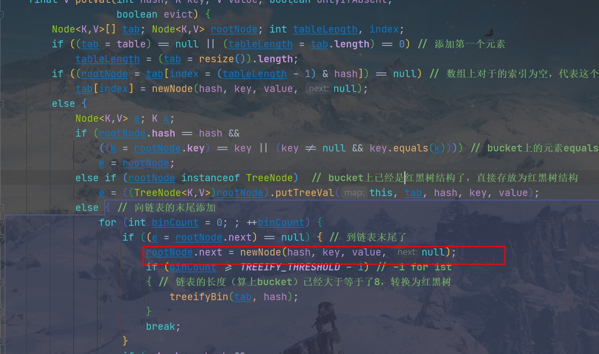

# 1.HashMap

重点字段：

- DEFAULT_LOAD_FACTOR=0.75

  ```txt
  默认加载因子 
  loadFactor加载因子是控制数组存放数据的疏密程度，
  loadFactor越趋近于1，那么 数组中存放的数据(entry)也就越多，
  也就越密，也就是会让链表的长度增加，loadFactor越小，也就是趋近于0，
  数组中存放的数据(entry)也就越少，也就越稀疏。
  
  loadFactor太大可能导致链表过长，查找元素效率低。
  而太小导致数组的空闲空间太多，利用率低，存放的数据会很分散。
  loadFactor的默认值为0.75f是官方给出的一个比较好的临界值。
  ```

- TREEIFY_THRESHOLD=8

  ```
  树化阈值。当桶(bucket)上的结点数大于这个值时会转成红黑树
  ```

- UNTREEIFY_THRESHOLD=6

  ```
  链表化阈值（当桶(bucket)上的结点数小于这个值时树转链表）
  ```

- MIN_TREEIFY_CAPACITY=64

  ```
  桶中结构树化对应的table的最小长度
  ```

- loadFactor=0.75

  ```
  计算阈值使用，必须大于0
  ```

- threshold = loaloadFactor * 数组长度

  ```
  扩容阈值，当HashMap拥有的元素数量大于了threshold，就会触发数组的扩容
  ```

## 1.1 put方法：

- 如果是第一次添加元素，先初始化数组，在计算索引位置直接放入就行
- 计算索引后，数组中对应的那个bucket不存在，直接放到这个bucket
- 计算索引后，数组中对应的那个bucket存在
  - equals根节点，直接替换
  - 根节点为树形节点，代表已经树化，调用红黑树来放节点
  - 以此遍历这个bucket链表，如果equals，直接替换。否则遍历到链表的末尾，再根据当前链表的长度来决定是放在末尾还是红黑树化
    - 红黑树化要求：链表的长度（算上bucket）已经大于等于了8且数组长度大于64

## 1.2 resize方法：

**HashMap数组的长度始终为2的次幂，且扩容时都是长度加倍。原因就是方便扩容**

>  试想一下，现要扩容一个已经有链表结构的数组:
>
>  ​	先创建一个长度为2倍的新数组。
>
>  ​	如果原数组某一个bucket（数组中的一个位置）为空或只有一个元素，不具备链表结构，那么这个bucket很好计算。
>
>  ​	如果一个bucket已经有链表的结构了，那么计算当前Node在新数组的索引方法：当前Node中key的hash值 & （新数组长度 - 1），因为新数组的长度始终是2的次幂，且是旧数组的2倍。所以这个计算出来的新索引要么是原索引，要么就是原索引的2倍（只取决于key的hash高一位是不是0），计算索引的核心方法如下。所以，将链表结构的bucket重新分配到新数组中就简单很多了

```java
// e.hash & oldCap == 0 就代表e的hash值（转换为2进制）高一位为0，
// 与（新的容量-1）相与后，其在数组的索引位置不变
if ((e.hash & oldCap) == 0) {
    if (loTail == null)
        loHead = e;
    else
        loTail.next = e;
    loTail = e;
}
else { // 这里则高一位为1，与新的容量 & 后，
     // 其在新数组的索引位置会增加新容量的扩大值（即原容量的大小）
    if (hiTail == null)
        hiHead = e;
    else
        hiTail.next = e;
    hiTail = e;
}
```

## 1.3 线程不安全

当两个线程同时put数据时，且被put的两个数据能定位到HashMap数组的相同那个bucket位置上，就可能产生一个覆盖掉另一个的可能，造成一个数据消失。



如上如，当两个线程同时到达红框位置，且放在一个bucket里，就会出现被覆盖，导致一个放入的数据消失了

# 2. LinkedHashMap

LinkedHashMap既是Map，有具有排序功能，根据accessOrder的值来排序

重点字段：

- head：连接头节点

- tail：链表为节点

- accessOrder（默认false）：

  >  false: 表示按照放入顺序排序，越晚放入的元素就越排在后面。
  >
  >  true：按访问时间排序。最近一个被访问的数据将会排在链表末尾

## 2.1 排序如何实现

```java
static class Entry<K,V> extends HashMap.Node<K,V> { // 具有链表结构的Entry
    // 前一个节点和后一个节点
    Entry<K,V> before, after;
    Entry(int hash, K key, V value, Node<K,V> next) {
        super(hash, key, value, next);
    }
}
```

LinkedHashMap的Entry新增了**before节点和after节点，所以是个双向链表结构。**

并重写了**java.util.HashMap#newNode**和**java.util.LinkedHashMap#afterNodeAccess**方法

**新节点添加到末尾**：newNode方法在构造新节点时使用，会将当前结点设为tail

**最近一次被访问的节点移动到末尾**：如果accessOrder为true，那么从map里获取数据时，会触发afterNodeAccess，将当前节点设置到tail。

LinkedHashMap并设计了很多内部的遍历器，在用map的遍历方法时，负责按顺序取出数据

# 3. ConcurrentHashMap

利用CAS和加锁，实现线程安全的Map数据结构

ConcurrentHashMap的数据结构和HashMap差不多，也是数组+链表实现，当链表长度大于8转化为红黑树，红黑树长度小于6退化为链表

## 3.1 put方法

死循环put元素，直到操作成功才退出

- 数组还没初始化，开始数组的初始化
- 数组的bucket还未被占用，CAS占用（成功了就break，失败了就代表已经被其他节点占用了，进行下一次循环进入其他if分支）
- 有线程正在进行扩容操作，则先帮助扩容
- bucket被暂用，锁住根节点，开始构造到链表的为尾节点。添加到尾节点后，在判断当前链表长度是否超过8，否则就转换为红黑树

# 4.AbstractQueuedSynchronizer

重要的内部数据结构Node:

​	Node是一个通用的数据结构，既充当同步队列节点，也充当等待队列的节点

- **同步队列**：当线程获取锁时，未获取到锁的线程会构造成一个Node，并放入同步队列，等待被唤醒。
- **等待队列**：当已经获取到锁的线程触发**java.util.concurrent.locks.Condition#await()**方法阻塞自己，让出锁时。会将当前线程构造成一个Node，并放入等待队列。而当其他线程调用**java.util.concurrent.locks.Condition#signal**等方法时，便会将等待队列的Node转入到同步队列

```java
static final class Node {
    // 共享锁
    static final Node SHARED = new Node();
    // 互斥锁
    static final Node EXCLUSIVE = null;
    //  取消获取锁
    static final int CANCELLED =  1;

    static final int SIGNAL    = -1;
    // 等待condition唤醒（等待队列才会用到这个状态）
    static final int CONDITION = -2;
    static final int PROPAGATE = -3;
	// 当前节点的状态
    volatile int waitStatus;
    // 同步队列专用
    volatile Node prev;
    // 同步队列专用
    volatile Node next;
    // 等待线程
    volatile Thread thread;
    // 等待队列专用（配合Condition）
    Node nextWaiter;
	// 判断当前节点是互斥锁，还是共享锁
    final boolean isShared() {
        return nextWaiter == SHARED;
    }

    final Node predecessor() throws NullPointerException {
        Node p = prev;
        if (p == null)
            throw new NullPointerException();
        else
            return p;
    }

    Node() {    // Used to establish initial head or SHARED marker
    }

    Node(Thread thread, Node mode) {     // Used by addWaiter
        this.nextWaiter = mode;
        this.thread = thread;
    }

    Node(Thread thread, int waitStatus) { // Used by Condition
        this.waitStatus = waitStatus;
        this.thread = thread;
    }
}
```

关键字段：

```java
// 同步队列专属的头尾节点。
// 因为只有在同步队列里的线程才需要被唤醒。等待队列里的线程如果要被唤醒，需要先加入到同步队列
private transient volatile Node head;
private transient volatile Node tail;
// 可获取到锁的次数
private volatile int state;
// 自旋的阈值（纳秒）。当超时等待时间小于这个值时，就不会再暂停线程，而是自旋。因为这个时间已经很少了，考虑到阻塞线程后上线文切换会消耗时间，就没必要再阻塞了
static final long spinForTimeoutThreshold = 1000L;
// 获取到独占锁的线程
private transient Thread exclusiveOwnerThread;
```

关键方法：

```java
// 获取共享锁
private void doAcquireSharedInterruptibly(int arg)
    throws InterruptedException {
    final Node node = addWaiter(Node.SHARED);
    boolean failed = true;
    try {
        for (;;) {
            final Node p = node.predecessor();
            if (p == head) {
                int r = tryAcquireShared(arg);
                if (r >= 0) { // 至少当前线程获取成功了，但可能state值已经被用完了
                    // 获取成功，传播给下一个共享Node，根据state的剩余值来判断是否需要唤醒下一个共享Node里的线程
                    setHeadAndPropagate(node, r);
                    p.next = null; // help GC
                    failed = false;
                    return;
                }
            }
            if (shouldParkAfterFailedAcquire(p, node) &&
                parkAndCheckInterrupt()) // 不能获取到锁线程就park
                throw new InterruptedException();
        }
    } finally {
        if (failed)
            cancelAcquire(node);
    }
}
// 释放共享锁
private void doReleaseShared() {
        for (;;) {
            Node h = head;
            if (h != null && h != tail) {
                int ws = h.waitStatus;
                if (ws == Node.SIGNAL) {
                    if (!compareAndSetWaitStatus(h, Node.SIGNAL, 0))
                        continue;            // loop to recheck cases
                    unparkSuccessor(h);
                }
                else if (ws == 0 &&
                         !compareAndSetWaitStatus(h, 0, Node.PROPAGATE))
                    continue;                // loop on failed CAS
            }
            if (h == head)                   // loop if head changed
                break;
        }
    }
```

# 5.ReentrantLock

以ReentrantLock为例，分析公平锁和非公平锁的实现。

因为ReentrantLock是互斥锁，所以只允许一个线程获取到锁，所以AQS的state最大只能为1

## 5.1 非公平锁（NonfairSync）：

lock（加锁过程）：

- java.util.concurrent.locks.ReentrantLock.Sync#nonfairTryAcquire：利用CAS尝试设置state，能设置成功，代表获取到锁，成功返回。设置失败，代表已经被其他线程获取了锁，返回失败
- 返回失败后：
  - 将当前线程构造为Node节点，设置到同步队列的链表中
  - 进入到**java.util.concurrent.locks.AbstractQueuedSynchronizer#acquireQueued**方法：死循环获取当前Node的前一个节点（**同步队列的首节点时成功获取到锁的节点**），如果前驱结点为首节点，当前Node才有资格获取锁。如果还是获取不到，就调用**java.util.concurrent.locks.LockSupport#park**(java.lang.Object)方法阻塞当前线程，等待其他线程唤醒再去竞争锁

unlock（释放锁）：

- java.util.concurrent.locks.ReentrantLock.Sync#tryRelease：复原state（将其归0），exclusiveOwnerThread设为null
- java.util.concurrent.locks.AbstractQueuedSynchronizer#release：在tryRelease成功后，使用**java.util.concurrent.locks.LockSupport#unpark**方法唤醒同步队列首节点的下一个节点里的线程，让他再去尝试获取锁

## 5.2 公平锁（FairSync）：

lock（加锁过程）：

和非公平锁很像，不同的部分就在覆盖了**java.util.concurrent.locks.AbstractQueuedSynchronizer#tryAcquire**这个方法和非公平锁略有不同。在新的线程获取锁失败，并将自己构造为Node节点并放入同步队列链表后，还会通过调用**java.util.concurrent.locks.AbstractQueuedSynchronizer#hasQueuedPredecessors**方法

```java
 /** 查询是否有线程等待获取的时间长于当前线程
 * 判断是否存在队列中第二个Node(因为首节点是个空节点)，且第二个节点中的线程是否是当前线程
 * 也就是说：判断同步队列中当前节点是否有前驱结点
 * true:代表当前线程不是等待最久的线程或压根就没有等待的线程
 * false:在代表当前线程已经是等待最久的线程（毕竟队列越前面，则代表进去的越久）<p/>
 * 只有公平锁才需要用到这个方法，来判断当前线程是否等待时间最长
 */
public final boolean hasQueuedPredecessors() {
    Node t = tail; 
    Node h = head;
    Node s;
    // 用 h != t 来做判断是因为调用这个方法的线程此时还没有进入等待队列
    // 如果 h != t，则代表队列中有线程在等待获取锁
    return h != t &&
        ((s = h.next) == null || s.thread != Thread.currentThread());
}
```

**来测试当前线程是否是等待最久的线程（也就是同步队列是否还有其他等待节点，因为新加的节点总是插入到队尾，弹出是总是从队首弹出，先进先出**），如果是等待最近的线程，才有资格尝试获取锁

```java
// ReentrantLock的公平锁第一次尝试获取锁
protected final boolean tryAcquire(int acquires) {
        final Thread current = Thread.currentThread();
        int c = getState();
        if (c == 0) {
            if (!hasQueuedPredecessors() && // 测试当前线程是否是等待最久的线程
                compareAndSetState(0, acquires)) {
                setExclusiveOwnerThread(current);
                return true;
            }
        }
        else if (current == getExclusiveOwnerThread()) {
            int nextc = c + acquires;
            if (nextc < 0)
                throw new Error("Maximum lock count exceeded");
            setState(nextc);
            return true;
        }
        return false;
    }
}
```

unlock（释放锁）：和非公平锁一样

## 5.3 总结

### 5.3.1 为什么叫公平锁和非公平锁

​	根据上面的分析，**公平锁在获取锁是总是会先判断当前线程是否是等待最久的线程**。**所以，就算是同步队列存在大量Node，且有线程第一次在获取锁，那么，下一次获取到锁的线程也一定是同步队列的首节点的下一个节点（首节点就是当前获取到锁的节点，只有获取成功了，同步才会更新首节点）**

​	而**非公平锁对于已经进入同步队列的线程来说，肯定也只会首节点的下一个线程能获取锁，但对于还未构造成Node加入到同步队列的线程来说，这个线程和首节点的下一个节点里的线程能竞争获取锁**，所以非公平。**但对于已经进入同步队列的线程来说，前驱结点是一定比后面的节点先获取到锁的**

### 5.3.2 **各自优势**

- 公平锁：防止线程饥饿，分散性很好
- 非公平锁：更快。一是获取锁是不用判断当前线程是否是等待最就的线程。二是**上下文交换没有公平锁频繁**。在存在大量锁竞争的前提下，可以肯定，公平锁上下文切换很频繁，获取锁后的线程再次获取锁时是一定会阻塞的。而非公平锁则不一样，下一次获取到锁的线程仍可能是上一次获取到锁的线程，没有上下文切换

# 6.CountDownLatch

CountDownLatch为共享锁实现，只能使用一次。用来“卡点”，阻塞的线程需要等待其他线程准备好了后（countDown直到AQS里的state为0），才继续被唤醒执行后面的代码。

在CountDownLatch中，AQS里的state值并不表示可获取到锁的次数，而是**java.util.concurrent.CountDownLatch#countDown** state值的次数后会释放所有调用了**java.util.concurrent.CountDownLatch#await()**的线程

内部的同步器Sync主要方法

```java
// 获取共享锁，只有AQS的state为0才能获取到
protected int tryAcquireShared(int acquires) {
    return (getState() == 0) ? 1 : -1;
}

// 释放共享锁，state第一次被减为0才释放成功，也就表示了CountDownLatch只能用一次
protected boolean tryReleaseShared(int releases) {
    // Decrement count; signal when transition to zero
    for (;;) {
        int c = getState();
        if (c == 0)
            return false;
        int nextc = c-1;
        if (compareAndSetState(c, nextc))
            return nextc == 0;
    }
}
```

await方法会阻塞当前线程，直到其他线程“拉下所有门闩”。阻塞的线程会构造为共享节点加入同步队列，只有队首节点的下一个节点才有资格尝试获取锁，获取不到就LockSupport#park

countDown会将state值减小1，当state将为0时，释放同步队列里的第二个共享节点里的线程。当这个线程释放后，就能成功获取到锁了，将这个时间传播下去，一次唤醒同步队列里的所有共享节点。至此，所有被阻塞的线程都被唤醒且会成功获取到锁，最终从await方法里返回

# 7.Semaphore

**信号量，共享锁实现。可以指y段使用Semaphore锁住的代码最多能有state个线程同时运行。**

也分为公平锁和分公平锁，其判断方式完全和ReentrantLock一致。

​		**非公平锁允许准备进入同步块的线程（还未加入同步队列）和同步队列中的第二个节点竞争获取锁。而公平锁则只允许同步队列中第二个节点里的线程能尝试获取锁。**

​		**其实现方式就是将state设为我们允许并发运行的线程数量，每当一个线程获取到锁后，将state - 1，如果state为0则阻塞所有准备进入同步块的线程，并将其构造为共享节点加入同步队列。每当有线程从同步块退出时，将state + 1，并根据是否非公平来唤醒同步队列的第二个节点来尝试获取锁**

# 8.Condition接口

**等待通知接口，代替Object原生的wait和notify，其具体实现为AQS里的ConditionObject**

主要字段：

```java
// 等待队列中的首节点
private transient Node firstWaiter;
// 等待队列中的尾节点
private transient Node lastWaiter;
```

Condition的实现是用了**等待队列（但数据结构还是AQS里的Node，将Node#waitStatus设为2就表示这是等待节点）**

只有获取到锁的线程才能调用Condition的阻塞和唤醒方法

## 8.1 Condition#await

```java
public final void await() throws InterruptedException {
    if (Thread.interrupted()) // 响应中断
        throw new InterruptedException();
    Node node = addConditionWaiter();
    int savedState = fullyRelease(node); // 释放锁并且唤醒同步队列中的第二个节点
    int interruptMode = 0;
    // 死循环判断当前节点是否在等待队列中
    // 等待队列中的节点一定要阻塞，而同步队列中的节点是可以被唤醒的
    while (!isOnSyncQueue(node)) {
        LockSupport.park(this);
        if ((interruptMode = checkInterruptWhileWaiting(node)) != 0)
            break;
    }
    // 当signal后，需要重新获取锁，要复原现场，需要重新持有上一次所持有的所有的state值
    if (acquireQueued(node, savedState) && interruptMode != THROW_IE)
        interruptMode = REINTERRUPT;
    if (node.nextWaiter != null) // clean up if cancelled
        unlinkCancelledWaiters();
    if (interruptMode != 0) // 当前节点有中断
        reportInterruptAfterWait(interruptMode);
}
```

流程分析：

- 首先将当前线程构造为等待节点，并加入到等待队列的末尾
- 其次释放锁资源（能够await的线程一定是获取到锁的），同时唤醒同步队列的第二个节点，让其尝试获取锁
- 死循环判断当前节点是否为同步节点（等待节点在等待队列里，是一定要阻塞的。同步节点在同步队列里，是可以并被唤醒并尝试获取锁的），await到这里线程就阻塞了
- 当被唤醒后，当前节点一定被加入了同步队列，再尝试获取锁，如果能获取到，代表就可以返回了。如果获取不到，就表示当前同步块被其他线程暂用了，也还是阻塞。不过下一次被唤醒后就会通过同步队列的唤醒方式来尝试获取锁

## 8.2 Condition#signal和signalAll

```java
private void doSignal(Node first) {
    do {
        // 将首节点的nextWaiter转移到首节点，如果nextWaiter为空，则表示队列中只有一个节点，且首尾相同
        if ( (firstWaiter = first.nextWaiter) == null)
            lastWaiter = null;
        first.nextWaiter = null; // gc处理
    } while (!transferForSignal(first) &&
             (first = firstWaiter) != null);
}
// 将当前的等待节点转换为同步节点，并加入到同步队列的末尾
final boolean transferForSignal(Node node) {
        if (!compareAndSetWaitStatus(node, Node.CONDITION, 0))
            return false;
        Node p = enq(node);
        int ws = p.waitStatus;
        if (ws > 0 || !compareAndSetWaitStatus(p, ws, Node.SIGNAL))
            LockSupport.unpark(node.thread); // 前驱节点被取消了，或者设置为SIGNAL失败
        return true;
    }
```

signal主要就是将等待队列的首节点转移到同步队列的为节点，signalAll则是将等待队列中的所有节点都转移到同步节点。所以signal并不能唤醒await的线程

## 8.3 总结

Condition实现了等待通知，当一个线程进入同步块后，就可以调用await，释放自己获取的锁资源，将自己阻塞。内部实现是首先释放锁资源，再将当前线程构造成一个等待节点，加入ConditionObject的等待队列的末尾。而当其他进入同步块的线程调用signal后，会将等待队列的首节点转移到同步队列，并将其变成同步节点，最后再使用同步队列的唤醒机制等待被唤醒。

​	所以signal并不能直接唤醒一个await的线程，最佳使用案例就是消费者发送者机制，比如阻塞队列。

# 9. ReentrantReadWriteLock

​		读写锁，支持并发的读或互斥的写。读写锁分别各自实现，读锁使用共享锁，写锁使用互斥锁。ReentrantReadWriteLock内部的ReadLock和WriteLock都使用了内部同一个Sync对象来实现读写加锁的功能，在Sync内，他将AQS的state转换为二进制，高十六位表示读状态位，低十六位表示写状态位。由于读是共享的，所以state的高十六位表示了当前有多少个线程在读，在此期间写锁是禁用的。而低十六位是写锁，所以只可能有一个线程，但可能数字大于1（这是就表示写锁重入了）。当写锁被占用是，读是不允许的

```java
static final int SHARED_SHIFT= 16;                     //   读状态位            写状态位
static final int SHARED_UNIT  = (1 << SHARED_SHIFT); // 0000000000000001 0000000000000000
static final int MAX_COUNT = (1 << SHARED_SHIFT) - 1;//0000000000000000 1111111111111111
static final int EXCLUSIVE_MASK = (1 << SHARED_SHIFT) - 1;//0000000000000000 1111111111111111
// 获取共享锁冲入次数（读锁专用）
static int sharedCount(int c)    { return c >>> SHARED_SHIFT; }
// 获取排他锁冲入次数（写锁专用）
static int exclusiveCount(int c) { return c & EXCLUSIVE_MASK; }
```

读写锁都支持重入，但写锁只能让当前线程重入，并且要解锁时需要unlock重入的次数。

# 10. ThreadPoolExecutor

## 10.1 重要字段：

```java
//状态控制器，初始值： 1110 0000 0000 0000 0000 0000 0000 0000
private final AtomicInteger ctl = new AtomicInteger(ctlOf(RUNNING, 0));
private static final int COUNT_BITS = Integer.SIZE - 3; // 29位
// 0001 1111 1111 1111 1111 1111 1111 1111
// 1110 0000 0000 0000 0000 0000 0000 0000 取反后
private static final int CAPACITY   = (1 << COUNT_BITS) - 1;
                                                            

// 运行中：111 00000000000000000000000000000
private static final int RUNNING    = -1 << COUNT_BITS; 
// 不再接受新任务的入队列，但已经入队列还未还未的任务还可以继续执行
// 000 00000000000000000000000000000
private static final int SHUTDOWN   =  0 << COUNT_BITS; 
// 不接受新任务入队列，也不处理队列中的任务，中断正在处理任务的worker
// 001 00000000000000000000000000000
private static final int STOP       =  1 << COUNT_BITS; 
// 全部完成，任务终止，worker数为0
// 010 00000000000000000000000000000
private static final int TIDYING    =  2 << COUNT_BITS;
// 011 00000000000000000000000000000
private static final int TERMINATED =  3 << COUNT_BITS;

// 计算线程池的状态
private static int runStateOf(int c)     { return c & ~CAPACITY; } // 后29位为0，前3为跟随c
// 计算线程池有多少线程
private static int workerCountOf(int c) { return c & CAPACITY; } // 前3位为0，后面29为跟随 c
private static int ctlOf(int rs, int wc) { return rs | wc; }

// 任务队列
private final BlockingQueue<Runnable> workQueue;
// 主锁
private final ReentrantLock mainLock = new ReentrantLock();
// 工作线程的Set
private final HashSet<Worker> workers = new HashSet<Worker>();

private final Condition termination = mainLock.newCondition();
// 池已经创建的线程最大数（一个动态值）
private int largestPoolSize;
// 完成的任务数
private long completedTaskCount;
// 创建线程的工厂
private volatile ThreadFactory threadFactory;
// 拒绝策略
private volatile RejectedExecutionHandler handler;
// 非核心线程数的保持时间
private volatile long keepAliveTime;
// 是否允许核心线程过期
private volatile boolean allowCoreThreadTimeOut;
// 核心线程数
private volatile int corePoolSize;
// 最大线程数
private volatile int maximumPoolSize;
```

> ​		ThreadPoolExecutor利用一个int类型的数来同时保存当前线程池状态和工作线程的数量，高3为用来表示当前线程的数量，低29为用来保存工作线程的数量。
>
> ​		ThreadPoolExecutor内部的Worker就是工作线程的抽象，每一个Worker都是一个工作现场，同时，Worker有继承了AQS可以充当锁的角色，目的是更好的让外部知道当前worker是否正在运行，worker运行时（获取到任务后开始运行）会加锁，通过测试当前worker是否加上锁或者是否可以获得当前worker的锁，便可知道worker是否繁忙，有助于worker的清理

## 10.2 核心方法

- shutdown：将当前线程池状态设为SHUTDOWN状态，在中断空闲的Worker（判断Worker是否空闲就通过它的锁方法）。**所以，执行了这个方法后，正在执行的任务不会被中断，且已经存在workQueue中的Runnable也可以被执行，但是不能放入新的Runnable**
- shutdownNow：将当前线程池状态设为STOP状态，将所有Worker设置为中断位，且倒出workQueue中的所有Runnable。**所以，执行了这个方法后，正在允许的任务如果检测了中断位就会立即退出，如果没检测就还是会执行完，而已经存在workQueue中的Runnable将不会被执行，会将这些Runnable返回给调用者，让调用者处理**

```java
// 执行Runnable的方法
public void execute(Runnable command) {
    if (command == null)
        throw new NullPointerException();
    // 获取当前线程池状态
    int c = ctl.get();
    // 判断是否小于核心线程数，是则新建线程运行任务
    if (workerCountOf(c) < corePoolSize) {
        if (addWorker(command, true))
            return;
        c = ctl.get();
    }
    // 核心数满了，并且当前线程池状态为Running，加到等待队列中
    if (isRunning(c) && workQueue.offer(command)) {
        int recheck = ctl.get();
        if (! isRunning(recheck) && remove(command))
            reject(command);
        else if (workerCountOf(recheck) == 0)
            addWorker(null, false);
    }
    // 等待队列满了，新建线程，但不能大于最大线程数
    else if (!addWorker(command, false))
        // 创建失败，直接调用拒绝策略
        reject(command);
}
```

当addWorker且成功创建Worker后，就会启动Worker，Worker实现了Runnable，

```java
// Worker的Runnable方法
public void run() {
    runWorker(this);
}

final void runWorker(Worker w) {
        Thread wt = Thread.currentThread();
        Runnable task = w.firstTask;
        w.firstTask = null;
        w.unlock(); // allow interrupts
        boolean completedAbruptly = true;
        try {
            // 利用阻塞队列，一直循环取任务执行（阻塞队列为空时会阻塞当前想取出元素的线程）
            while (task != null || (task = getTask()) != null) {
                w.lock();
                if ((runStateAtLeast(ctl.get(), STOP) ||
                     (Thread.interrupted() &&
                      runStateAtLeast(ctl.get(), STOP))) &&
                    !wt.isInterrupted())
                    wt.interrupt();
                try {
                    beforeExecute(wt, task);
                    Throwable thrown = null;
                    try {
                        task.run();
                    } catch (RuntimeException x) {
                        thrown = x; throw x;
                    } catch (Error x) {
                        thrown = x; throw x;
                    } catch (Throwable x) {
                        thrown = x; throw new Error(x);
                    } finally {
                        afterExecute(task, thrown);
                    }
                } finally {
                    task = null;
                    w.completedTasks++;
                    w.unlock();
                }
            }
            completedAbruptly = false;
        } finally {
            processWorkerExit(w, completedAbruptly);
        }
    }
// 核心方法之一，从阻塞队列中取任务
private Runnable getTask() {
        boolean timedOut = false; // Did the last poll() time out?
// 死循环取任务
        for (;;) {
            int c = ctl.get();
            int rs = runStateOf(c);

            // Check if queue empty only if necessary.
            if (rs >= SHUTDOWN && (rs >= STOP || workQueue.isEmpty())) {
                decrementWorkerCount();
                return null;
            }

            int wc = workerCountOf(c);

            // 允许核心线程过期和非核心线程都可以超时取任务
            boolean timed = allowCoreThreadTimeOut || wc > corePoolSize;

            if ((wc > maximumPoolSize || (timed && timedOut))
                && (wc > 1 || workQueue.isEmpty())) {
                if (compareAndDecrementWorkerCount(c))
                    return null;
                continue;
            }

            try {
                // 如果是超时取任务，时间结束后还是取不到，则设置timedOut为true，下次循环就可以直接返回null退出了，这样，这个Worker也就终结了
                Runnable r = timed ?
                    workQueue.poll(keepAliveTime, TimeUnit.NANOSECONDS) :
                    workQueue.take();
                // 不为null才返回，就不用担心返回null而终结了当前线程
                if (r != null)
                    return r;
                timedOut = true;
            } catch (InterruptedException retry) {
                timedOut = false;
            }
        }
    }
```

## 10.3 总结

**execute Runnable的流程**

- 先判断线程池的工作线程数量是否小于核心线程数，小于核心线程数直接新建线程来执行
- 如果核心线程数满了，则将Runnable投入到workQueue中
- 如果workQueue满了，则创建非核心线程来继续执行任务
- 如果线程池中的工作现场数量到达了maximumPoolSize的值，则使用拒绝策略来执行任务

**Worker的工作流程**

​		调用getTask取任务来执行，如果取出的任务为空，则这个Worker也就结束了。getTask不为空的话，还是先进性一系列的线程池状态校验，在执行钩子函数（beforeExecute），在真正的执行这个Runnable，再执行钩子函数（afterExecute），最后再将completedTasks加1，表示当前Worker完成的任务总数

**getTask流程**（实现线程过期回收的关键）

- 先进行一系列的状态校验
- **判断是否允许超时：设置了allowCoreThreadTimeOut为true或当前线程池的工作线程数量大于核心线程数量就允许超时**
- 判断是否触发了该减少工作数量数量机制，然后返回null
- 通过阻塞队列取Runnable，如果不允许超时，则会一直阻塞到这。而允许超时，则会超时等待keepAliveTime纳秒取Runnable，没有就返回null，触发工作现场的减少

# 11.Future

java里Future的默认实现是FutureTask，将Callable作为构造器参数传入，就有了执行Callable的能力

## 11.1 重点字段和主要方法：

```java
// state字段，表示了当前Future的状态，取值为如下字段
private volatile int state;

private static final int NEW          = 0; // 初始状态，新建
private static final int COMPLETING   = 1; // 正在结束
private static final int NORMAL       = 2; // 正常执行完毕
private static final int EXCEPTIONAL  = 3; // 异常执行完毕
private static final int CANCELLED    = 4; // 前一个状态必须是NEW，已取消（未中断）
private static final int INTERRUPTING = 5; // 前一个状态必须是NEW，正在中断（中断）
private static final int INTERRUPTED  = 6; // 取消成功的才可以设置，中断完成（中断）

// 待运行的Callable任务
private Callable<V> callable;
// Callable执行的结果。如果出现执行的过程中异常，则保存的是异常对象
private Object outcome;
// 运行Callable#call方法的线程（也即是运行业务代码的线程）
private volatile Thread runner;
// 当这里面的Callable还未执行完，却有其他线程调用Future#get()方法，
// 	会将其他线程阻塞并构造为等待节点，维持一个链表结构，以便在Callable执行完毕后唤醒并回调
private volatile WaitNode waiters;


public void run() {
    if (state != NEW ||
        !UNSAFE.compareAndSwapObject(this, runnerOffset,
                                     null, Thread.currentThread()))
        return;
    try {
        Callable<V> c = callable;
        if (c != null && state == NEW) {
            V result;
            boolean ran;
            try {
                // 执行业务方法
                result = c.call();
                ran = true;
            } catch (Throwable ex) {
                result = null;
                ran = false;
                setException(ex); // 异常结束，将状态设为EXCEPTIONAL，如果等待队列有节点，则唤醒对应的线程
            }
            if (ran)
                set(result); // 正常结束，将状态设为NORMAL，如果等待队列有节点，则唤醒对应的线程
        }
    } finally {
        runner = null;
        int s = state;
        if (s >= INTERRUPTING)
            handlePossibleCancellationInterrupt(s);
    }
}
// 阻塞获取
public V get() throws InterruptedException, ExecutionException {
    int s = state;
    if (s <= COMPLETING) // 还未完全结束Callabke，进入等待
        s = awaitDone(false, 0L);
    return report(s);
}
// 根据state判断是否需要阻塞并做对于的事
private int awaitDone(boolean timed, long nanos)
    throws InterruptedException {
    final long deadline = timed ? System.nanoTime() + nanos : 0L;
    WaitNode q = null;
    boolean queued = false;
    for (;;) {
        if (Thread.interrupted()) { // 当前线程支持响应中断
            removeWaiter(q);
            throw new InterruptedException();
        }

        int s = state;
        if (s > COMPLETING) { // Callable运行完毕，且result已经设置完毕
            if (q != null)
                q.thread = null;
            return s;
        }
        // 进入到以下分支，就代表Callable还未完全执行完毕

        else if (s == COMPLETING) // cannot time out yet  Callable运行完毕，但正在设置result，让出执行时间，等待下次判断
            Thread.yield();
        else if (q == null) // 第一次循环，构造等待节点
            q = new WaitNode();
        else if (!queued) // 还未加入等待队列，则将节点加入到等待队列中
            queued = UNSAFE.compareAndSwapObject(this, waitersOffset,
                                                 q.next = waiters, q);
        else if (timed) { // 是否运行超时判断
            nanos = deadline - System.nanoTime();
            if (nanos <= 0L) {
                removeWaiter(q);
                return state;
            }
            LockSupport.parkNanos(this, nanos);
        }
        else // 暂停当前线程，等待任务执行完毕的唤醒
            LockSupport.park(this);
    }
}
// 任务执行完毕，唤醒等待队列的所有节点
private void finishCompletion() {
    // assert state > COMPLETING;
    for (WaitNode q; (q = waiters) != null;) {
        if (UNSAFE.compareAndSwapObject(this, waitersOffset, q, null)) {
            for (;;) {
                Thread t = q.thread;
                if (t != null) {
                    q.thread = null;
                    LockSupport.unpark(t);
                }
                WaitNode next = q.next;
                if (next == null)
                    break;
                q.next = null; // unlink to help gc
                q = next;
            }
            break;
        }
    }

    done();

    callable = null;        // to reduce footprint
}
```

## 11.2 总结

FutureTask根据内部的state字段来判断当前任务运行到了哪个阶段并作出对于的抉择。

​		如果想获取任务执行的结果，要使用get来获取结果，get是个阻塞的方法。当任务还未执行完毕时，会将调用get的方法阻塞并构造成WaitNode，再通过内部的next字段链接下一个WaitNode，形成一个链表结构。当任务执行完毕后，内部调用的finishCompletion方法会判断等待链表是否为空，不为空就代表有线程在获取结果时被阻塞了，这时唤醒阻塞队列的所有线程，最终，调用get方法的线程返回结果。

# 12. ScheduledThreadPoolExecutor

## 12.1 ScheduledExecutorService

```java
/**
 * 创建一个一次性的延迟（定时）任务，框架中cron表达式就是通过此接口实现的
 * 只需要在任务完成后，在计算下一次的执行时间，再用此方法定时执行，以此类推
 */
public ScheduledFuture<?> schedule(Runnable command,
                                   long delay, TimeUnit unit);

/**
* 执行Callable接口的任务，也是一个一次性的定时任务
*/
public <V> ScheduledFuture<V> schedule(Callable<V> callable,
                                       long delay, TimeUnit unit);
/**
 * 基于固定的频率执行定时任务 
 * 例：初始执行任务的时间戳：当前时间戳（调用时）+ initialDelay 
 * 第二次执行：初始执行任务的时间戳 + period 
 * 第三次执行：第二次执行任务的时间戳 + period
 */
public ScheduledFuture<?> scheduleAtFixedRate(Runnable command,
                                              long initialDelay,
                                              long period,
                                              TimeUnit unit);
/**
 * 基于固定的周期执行定时任务 
 * 例：初始执行任务的时间戳：当前时间戳（调用时）+ initialDelay
 *  第二次执行：初始任务执行完结时的时间戳 + delay
 *  第三次执行：第二次任务执行完结时的时间戳 + delay
 *
 */
public ScheduledFuture<?> scheduleWithFixedDelay(Runnable command,
                                                 long initialDelay,
                                                 long delay,
                                                 TimeUnit unit);
```

## 12.2 DelayedWorkQueue

```java
// 数组初始容量
private static final int INITIAL_CAPACITY = 16;
// 数组实现的最小顶堆结构，queue[0]始终都是最快需要被执行的那个任务
private RunnableScheduledFuture<?>[] queue =
    new RunnableScheduledFuture<?>[INITIAL_CAPACITY];
private final ReentrantLock lock = new ReentrantLock();
private int size = 0;
// leader线程，定时等待queue[0]任务的那个线程
private Thread leader = null;

private final Condition available = lock.newCondition();
// 新加入了任务，判断时都需要上移（和父节点换个位置）并调整位置
private void siftUp(int k, RunnableScheduledFuture<?> key) {
    while (k > 0) {
        int parent = (k - 1) >>> 1; // 父节点的索引
        RunnableScheduledFuture<?> e = queue[parent];
        if (key.compareTo(e) >= 0) // 当前节点的下次执行时间更久，直接break
            break;
        // 当前节点的下次执行时间更快，继续递归向上遍历，直到放到合适的位置
        queue[k] = e;
        setIndex(e, k);
        k = parent;
    }
    queue[k] = key;
    setIndex(key, k);
}
/**
	重写的offer方法（该方法就是线程池投递任务的方法）
 */
public boolean offer(Runnable x) {
    if (x == null)
        throw new NullPointerException();
    RunnableScheduledFuture<?> e = (RunnableScheduledFuture<?>)x;
    final ReentrantLock lock = this.lock;
    lock.lock();
    try {
        int i = size;
        if (i >= queue.length)
            grow();
        size = i + 1;
        if (i == 0) { // 数组中还没有任务，直接放在首位
            queue[0] = e;
            setIndex(e, 0);
        } else { // 已存在定时任务，看是否需要调整位置
            siftUp(i, e);
        }
        if (queue[0] == e) {// 代表向队列添加了一个需要最快执行的任务
            // 需要重置leader线程，并将阻塞的线程从等待队列转移到同步队列，当下面的unlock后再唤醒阻塞线程
            leader = null;
            available.signal(); 
        }
    } finally {
        lock.unlock();
    }
    return true;
}
// 重写了take方法
public RunnableScheduledFuture<?> take() throws InterruptedException {
    final ReentrantLock lock = this.lock;
    lock.lockInterruptibly();
    try {
        for (;;) {
            RunnableScheduledFuture<?> first = queue[0];
            if (first == null) // 不存在定时任务，所有线程都在这等待
                available.await();
            else {
                long delay = first.getDelay(NANOSECONDS);
                if (delay <= 0) // 时间已过，弹出队首任务去执行它
                    return finishPoll(first);
                // 进入下面，无论怎样都要等待，所以直接把first置为null，下次循环再获取
                // 因为可能多个线程走到下面，都持有了队首的引用。避免出现RunnableScheduledFuture运行完了但不能及时回收的情况
                // 当然，也只有一次性的RunnableScheduledFuture才会回收，定时任务都是循环使用这个RunnableScheduledFuture的
                first = null; // don't retain ref while waiting
                if (leader != null) // 由leader存在，其他线程只需要无限期等待就行
                    available.await();
                else { // 没有leader存在，设置当前线程为leader，并定时等待（时间就为最近待执行的那个任务的距离下次执行时间间隔）
                    Thread thisThread = Thread.currentThread();
                    leader = thisThread;
                    try {
                        available.awaitNanos(delay); // 定时等待
                    } finally { // 时间一到，说明队首任务可执行了，但当前线程可能不是leader线程了，需要判断一下再置空
                        if (leader == thisThread) // 必须判断，有可能实时的添加了一个最快需要执行的线程，导致当前线程被取消了leader
                            leader = null;
                    }
                }
            }
        }
    } finally {
        if (leader == null && queue[0] != null)
            // 任务取出来了，leader为空且存在队首任务，需要唤醒一个无限等待的线程
            // 让其成为leader线程并继续定时等待
            available.signal();
        lock.unlock();
    }
}
```

## 12.3 ScheduledFutureTask

ScheduledFutureTask继承了FutureTask，当向定时任务线程池投递任务时（Runnable或Callable），都会将其封装为ScheduledFutureTask

重点字段和方法

```java
/** 
 * 当前任务的id（自增的），代表了进入队列的顺序 <br/>
 * 当两个定时任务下次执行时间一致时，sequenceNumber越小就会越早执行
 */
private final long sequenceNumber;
// 下次执行当前任务的纳秒时间戳
private long time;

/**
 * 执行定时任务的纳秒间隔时间
 * 大于0：代表固定的频率，不受任务的执行所花费的时间影响
 * 等于0：代表不是一个重复的任务（只会执行一次
 * 小于0：代表固定的时间间隔，基于任务执行完毕后的时间计算。（任务执行完后再基于当前时间计算下次执行时间）
 */
private final long period;
// 当前任务在数组中的索引
int heapIndex;

public long getDelay(TimeUnit unit) {
    return unit.convert(time - now(), NANOSECONDS);
}
// 比较方法，决定了放入数组的位置
public int compareTo(Delayed other) {
    if (other == this) // compare zero if same object
        return 0;
    if (other instanceof ScheduledFutureTask) {
        ScheduledFutureTask<?> x = (ScheduledFutureTask<?>)other;
        long diff = time - x.time;
        if (diff < 0)
            return -1;
        else if (diff > 0) // 当前任务的下次执行时间更长，返回正数
            return 1;
        else if (sequenceNumber < x.sequenceNumber)
            return -1;
        else
            return 1;
    }
    long diff = getDelay(NANOSECONDS) - other.getDelay(NANOSECONDS);
    return (diff < 0) ? -1 : (diff > 0) ? 1 : 0;
}

/**
 * false: 代表当前任务为一次性任务
 * true: 定时任务
 */
public boolean isPeriodic() {
    return period != 0;
}
// 当前任务执行完毕后，用来计算下次执行时间
private void setNextRunTime() {
    long p = period;
    // p为两次执行时间的时间间隔的纳秒值
    if (p > 0) // p大于0，即为固定时间执行的任务，基于初始运行时间计算下一次的执行时间
        time += p;
    else // p小于0，为基于完成任务的时间来执行，基于任务运行完的时间，来计算出下一次的执行时间
        time = triggerTime(-p);
}
// 主方法，运行当前定时任务
public void run() {
    boolean periodic = isPeriodic();
    if (!canRunInCurrentRunState(periodic))
        cancel(false);
    else if (!periodic) // 非定时任务，当作普通任务直接调用FutureTask的run方法运行
        ScheduledFutureTask.super.run();
    else if (ScheduledFutureTask.super.runAndReset()) { // 运行定时任务，且运行成功（没抛异常）
        setNextRunTime(); // 设置下一次执行时间
        reExecutePeriodic(outerTask); // 再把当前任务重新入队列
    }
}
/**
	父类的FutureTask中的方法，运行并重置状态，用于任务的多次执行 
     * 正常执行时：不会修改运行状态（也就是说这个操作不会修改state字段值，保持初始值，以支持重复执行）。
     * 出现异常时：还是将state设为EXCEPTIONAL，也就是说一个定时任务要是抛出了异常，之后就不会再执行它了
     */
protected boolean runAndReset() {
    if (state != NEW || // 不为NEW状态的都不执行
        !UNSAFE.compareAndSwapObject(this, runnerOffset,
                                     null, Thread.currentThread()))
        return false;
    boolean ran = false;
    int s = state;
    try {
        Callable<V> c = callable;
        if (c != null && s == NEW) {
            try {
                c.call(); // 不设置返回结果。多次执行的任务就不该有执行结果
                ran = true;
            } catch (Throwable ex) {
                setException(ex);  // 抛出异常，修改state为EXCEPTIONAL，以后也不在执行它
            }
        }
    } finally {
        // runner must be non-null until state is settled to
        // prevent concurrent calls to run()
        runner = null;
        // state must be re-read after nulling runner to prevent
        // leaked interrupts
        s = state;
        if (s >= INTERRUPTING)
            handlePossibleCancellationInterrupt(s);
    }
    return ran && s == NEW;
}
```

## 12.4 总结

[优秀的文章](https://segmentfault.com/a/1190000038371064)

​		ScheduledThreadPoolExecutor本质还是个线程池，**内部的DelayedWorkQueue就是工作队列。投递的定时任务都会封装为ScheduledFutureTask，并最终放入DelayedWorkQueue里的那个数组**

​		DelayedWorkQueue实现了BlockingQueue，是基于**数组的最小顶堆的数据结构**实现，以此**保证数组的第一个位置就是最近需要被执行的任务**。

​		ScheduledThreadPoolExecutor还使用了**Leader-Follower模式**，leader线程定时等待第一个任务，其余线程一般就都无限期等待（如果向工作队列添加的是一个最快需要被执行的任务，可能就有多个定时等待的线程，但leader线程始终都会是最快需要被执行任务的线程）

- **固定周期**：受执行时常影响，只有当任务结束后才相对于结束时间来计算任务的下次执行时间
- **固定频率**：不受任务的执行时常所影响，当任务投递到队列时就可以预判到以后任何执行该任务的时间

​	一个被投递的周期任务首先会封装成ScheduledFutureTask，再根据其下次执行时间放在DelayedWorkQueue的某个位置。如果放在了DelayedWorkQueue的队首，则使用定时任务线程池里的线程超时等待，以便时间到达后开始执行。正常执行完毕则会先根据其是固定周期任务还是固定频率的任务来计算下次执行时间并修赋值到ScheduledFutureTask的time字段，再将这个任务再次入队列，这样递归去执行。执行中如果抛出了异常，则会将ScheduledFutureTask的state修改为异常，之后就不再执行这个任务了