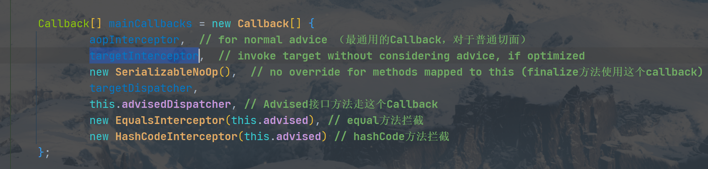
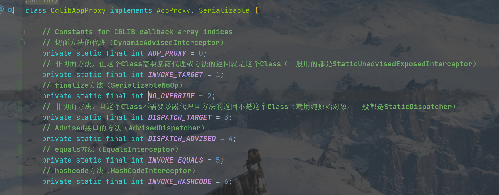
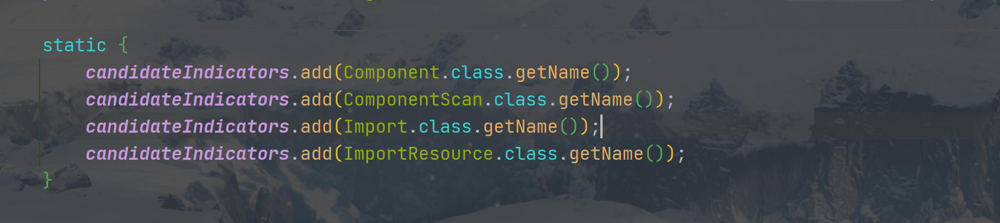
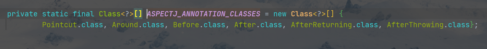

#   Spring(5.1.x)
## 1.bean实例化过程（BeanFactory#getBean方法看）

### 1.1 循环引用

#### 1.1.1 三级缓存

* 一级缓存（**DefaultSingletonBeanRegistry#singletonObjects**）：存放的是完全初始化好的bean，包括已实例化、填充内部依赖的bean，运行完初始化方法（@PostConstruct、afterPropertiesSet方法、指定的init-method方法）
* 二级缓存（**DefaultSingletonBeanRegistry#earlySingletonObjects**）：存放bean缓存（如果能被AOP，就是AOP对象），但还未填充属性和允许初始化方法
* 三级缓存（**DefaultSingletonBeanRegistry#singletonFactories**）：存放bean的工厂对象，使用这个工厂对象，可提前暴露出bean的引用（专用来提前暴露AOP对象的方法）

#### 1.1.2 **为什么要使用三级缓存**

三级缓存专门来解决AOP对象的暴露问题。如果没用AOP是可以只用一级缓存和二级缓存就解决的。但如果使用了AOP且没有三级缓存，那么必须在实例化后就马上完成AOP代理，但这和spring的设计初衷不同，AOP代理的完成时使用了bean的后置处理器**AnnotationAwareAspectJAutoProxyCreator**来完成的，也就是在初始化bean后执行的bean后置处理器方法（**AbstractAutowireCapableBeanFactory#initializeBean**），就不可能再实例化bean后进行代理，所以才有了三级缓存，仅用来提前暴露AOP对象

#### 1.1.3 三层级缓存真能完美解决吗？

如果有3个bean分别为A、B、C，A依赖B和C，B只依赖A，C什么都不依赖，但提供一个方法sayHello使用。

​		当开始实例化A时，实例化A后将其工厂对象放入三级缓存中，开始填充A属性，发现了B需要填充，开始实例化B，实例化B对象过程中又需要填充其属性A，这时能从三级缓存中取出了A的引用（但此时A不完整），如果B对象有一个初始化方法（@PostConstruct），调用A对象里的C对象的sayHello方法，但由于A此时只是个空壳，就会抛出空指针异常。

​		总的来说，就是在循环引用期间的调用初始化方法时，调用了尚未完全创建好的bean（空壳bean）的某个字段的方法，导致抛出NPE，导致服务启动失败

### 1.2 bean的创建流程

1. 实例化bean
2. 将其工厂对象（ObjectFactory）放入三级缓存（根据**AbstractAutowireCapableBeanFactory#allowCircularReferences**字段决定）
3. 填充依赖bean（**AbstractAutowireCapableBeanFactory#populateBean**）
4. 初始化bean（**AbstractAutowireCapableBeanFactory#initializeBean**）
   - 4.1 调用**BeanPostProcessor#postProcessBeforeInitialization方法**
   - 4.2 调用各种初始化方法（**@PostConstruct、afterPropertiesSet方法、指定的init-method方法**）
   - 4.3 调用**BeanPostProcessor#postProcessAfterInitialization**（AOP相关实现）
5. 注册destory相关方法（**AbstractBeanFactory#registerDisposableBeanIfNecessary**）

## 2.重要的后置处理器

### 2.1BeanPostProcessor

#### 2.1.1 CommonAnnotationBeanPostProcessor

​		用来处理**@javax.annotation.Resource**、**@javax.annotation.PostConstruct**、**@javax.annotation.PreDestroy**、**@javax.ejb.EJB**、**@javax.xml.ws.WebServiceRef**注解的处理器

使用地点：

  * **CommonAnnotationBeanPostProcessor#postProcessProperties**：在实例化bean时populateBean调用，用来**处理@Resource、@EJB、@WebServiceRef注解**，填充bean中的属性
  * **InitDestroyAnnotationBeanPostProcessor#postProcessBeforeInitialization**： 应用**@PostConstruct**注解
  * **InitDestroyAnnotationBeanPostProcessor#postProcessBeforeDestruction**： 应用**@PreDestroy**注解

> @Resource重点解析（ResourceElement为其解析后对应的数据结构）：
>
> 主要是name和type属性，lookup、mappedName用于JDNI，就不分析了，其余那几个没啥用。
>
> * name: 就是beanName，如果不填，ResourceElement.name会解析为字段名，且ResourceElement.isDefaultName为true
> * type: 默认为字段的Class类型

> @Resource很强大，既可以支持按beanName匹配，也可以按类型匹配。
>
> **按类型匹配条件**：CommonAnnotationBeanPostProcessor#fallbackToDefaultTypeMatch为true（默认就为true），且ResourceElement.isDefaultName为true（即不指定@Resource的name属性），且不能存在这个字段名的bean
>
> **按beanName匹配**：指定了@Resource的name属性 或 CommonAnnotationBeanPostProcessor#fallbackToDefaultTypeMatch为false或存在这个字段名的bean（就是上面的反向情况）

#### 2.1.2 AutowiredAnnotationBeanPostProcessor

用来处理**@org.springframework.beans.factory.annotation.Autowired**、**@org.springframework.beans.factory.annotation.Value**、**@javax.inject.Inject**注解的处理器

#### 2.1.3 AnnotationAwareAspectJAutoProxyCreator（非常重要）

​		Spring实现自动装配动态代理的Bean后置处理器，具有最高的执行优先级（表示是最先被执行的BeanPostProcessor。设置最高优先级的代码在org.springframework.aop.config.AopConfigUtils#registerOrEscalateApcAsRequired中）。其父类的postProcessAfterInitialization方法用在bean初始化（各种初始化方法调用完）后调用，用来判断当前bean是否能被增强，如果能则构建Advisor链，并使用ProxyFactory对其增强，增强后返回的bean已经是一个新的代理bean了。

**postProcessAfterInitialization方法**：找到能对这个bean进行增强的Advisor，利用ProxyFactory增强这个bean。ProxyFactory是创建代理bean的核心，代理bean创建出来就是一个新的bean，新的bean只提供切面逻辑的实现，用到原始bean的方法时，还是会交给原始bean去执行，原始bean并没有做任何改变，将原来的bean封装为TargetSource以供去执行真正的原始方法。

**判断能否对bean增强阶段：**

* 1. 获取容器中所有的Advisor（既有spring的，也有我们定·义的）
     * @EnableTransactionManagement注解导入的BeanFactoryTransactionAttributeSourceAdvisor，专门用来处理事物注解的
     * @EnableCaching注解导入的BeanFactoryCacheOperationSourceAdvisor，专门用来处理spring提供的缓存注解
     * 自定的：我们自己用@org.aspectj.lang.annotation.Aspect注解定义的切面类，org.springframework.aop.aspectj.annotation.AspectJAdvisorFactory#getAdvisors方法用来将@Aspect注解定义的切面类解析为一系列的Advisor，一个注解切面对应一个InstantiationModelAwarePointcutAdvisorImpl（Advisor的实现类）
  2. 用这些Advisor，依次对bean进行匹配，IntroductionAdvisor只需匹配类（ClassFilter），PointcutAdvisor既需匹配类（ClassFilter），也需要匹配方法（MethodMatcher）。只要能匹配上，就代表这个bean可以用这个Advisor进行增强。再收集到能对当前bean进行增强的Advisor，准备下一步的增强

##### 2.1.3.1 cglib增强

```java
// CglibAopProxy的创建代理方法
public Object getProxy(@Nullable ClassLoader classLoader) {
   if (logger.isTraceEnabled()) {
      logger.trace("Creating CGLIB proxy: " + this.advised.getTargetSource());
   }

   try {
      // 上一个被代理的目标类class（有可能已经是cglib的代理类了）
      Class<?> rootClass = this.advised.getTargetClass();
      Assert.state(rootClass != null, "Target class must be available for creating a CGLIB proxy");
      // 真正代理的目标类class
      Class<?> proxySuperClass = rootClass;
      if (ClassUtils.isCglibProxyClass(rootClass)) { // 已经是个cglib代理类了，就需要把真正被代理类的class和接口找出来
         proxySuperClass = rootClass.getSuperclass();
         Class<?>[] additionalInterfaces = rootClass.getInterfaces();
         for (Class<?> additionalInterface : additionalInterfaces) {
            this.advised.addInterface(additionalInterface);
         }
      }

      // 验证class的final相关方法并写日志
      validateClassIfNecessary(proxySuperClass, classLoader);

      // 创建通用的增强器，准备增强了
      Enhancer enhancer = createEnhancer();
      if (classLoader != null) {
         enhancer.setClassLoader(classLoader);
         if (classLoader instanceof SmartClassLoader &&
               ((SmartClassLoader) classLoader).isClassReloadable(proxySuperClass)) {
            enhancer.setUseCache(false);
         }
      }
      // 设置被代理类class为增强类的父类
      enhancer.setSuperclass(proxySuperClass);
      // 对增强类设置接口：Advised和SpringProxy
      enhancer.setInterfaces(AopProxyUtils.completeProxiedInterfaces(this.advised));
      enhancer.setNamingPolicy(SpringNamingPolicy.INSTANCE);
      enhancer.setStrategy(new ClassLoaderAwareUndeclaredThrowableStrategy(classLoader));

      // 设置拦截器（真正支持切面操作的拦截器）
      Callback[] callbacks = getCallbacks(rootClass);
      Class<?>[] types = new Class<?>[callbacks.length];
      for (int x = 0; x < types.length; x++) {
         types[x] = callbacks[x].getClass();
      }

      // 非常重要，就是通过这个filter来确定某个方法应该使用哪一个Callback的
      // 所以，代理类的任何一个方法只会用上一个Callback
      enhancer.setCallbackFilter(new ProxyCallbackFilter(
            this.advised.getConfigurationOnlyCopy(), this.fixedInterceptorMap, this.fixedInterceptorOffset));
      enhancer.setCallbackTypes(types);

      // 生成代理类的class并实例化其对象
      return createProxyClassAndInstance(enhancer, callbacks);
   }
   catch (CodeGenerationException | IllegalArgumentException ex) {
      throw new AopConfigException("Could not generate CGLIB subclass of " + this.advised.getTargetClass() +
            ": Common causes of this problem include using a final class or a non-visible class",
            ex);
   }
   catch (Throwable ex) {
      // TargetSource.getTarget() failed
      throw new AopConfigException("Unexpected AOP exception", ex);
   }
}
```

> cglib的增强实现主要步骤总结：
> 1. 校验final方法（只是打个日志，final方法不能增强）
>
> 2. 创建**org.springframework.cglib.proxy.Enhancer**（核心的cglib增强器）
>
> 3. 对Enhancer进行一系列的填充，包括设置当前Class为增强类的父类。当前Class的所有接口，增强类也要实现。
>
> 4. 设置增强Class的命名策略（BySpringCGLIB）
>
> 5. 默认再将当前线程上下文的ClassLoader设为加载增强Class字节码的ClassLoader
>
> 6. **对Enhancer设置一些Callback，并设置固定的CallbackFilter（ProxyCallbackFilter）。**非常重要：
>
>    
>
>    ​									Callback数组（每一个Callback都是方法的拦截器）
>
>    
>
>    ​									Callback数组的索引（**ProxyCallbackFilter#accept**实现），用来确定被增强的类的每一个方法该使用具体的某个拦截器，返回的是拦截器的数组索引
>
> 7. 生成增强Class的字节码并实例化（代理bean就产生了），将其返回
>
> ​	利用Arthas的反编译字节码命令（jad），可以发现cglib的源码里当调用任意一个方法时，使用的就是对应的Callback数组里的某个具体Callback。至于如何将Callback数组里的Callback应用到具体的方法中，就是上面说的ProxyCallbackFilter需要做的事（实现都在org.springframework.aop.framework.CglibAopProxy.ProxyCallbackFilter#accept方法里）。

**cglib代理类中方法有切面时的调用重点流程分析（这时使用的Callback就是DynamicAdvisedInterceptor）**：

- 根据org.springframework.aop.framework.AdvisorChainFactory#getInterceptorsAndDynamicInterceptionAdvice方法，对原始Method创建拦截器链（就是将所有的Advisor依次利用其中的ClassFilter和MethodMatcher对当前方法的Class和当前方法进行比对，能进行拦截就保存起来，最终缓存该方法对应的所有可用Advisor）
- 存在拦截器就会构造为CglibMethodInvocation，CglibMethodInvocation继承了ReflectiveMethodInvocation，先调用ReflectiveMethodInvocation#proceed方法，切面实现中如果继续调用proceed方法就会再回到ReflectiveMethodInvocation#proceed中，根据当前ReflectiveMethodInvocation中的拦截器索引（currentInterceptorIndex字段）拿到下一个增强器，依次这么反复传递下去。当拦截器调用完毕后，最后再调用原始bean的原始方法。

```java
// DynamicAdvisedInterceptor的入口
@Override
@Nullable
public Object intercept(Object proxy, Method method, Object[] args, MethodProxy methodProxy) throws Throwable {
   Object oldProxy = null;
   boolean setProxyContext = false;
   Object target = null;
   // 先准备目标对象源（调用原bean方法时会用到）
   TargetSource targetSource = this.advised.getTargetSource();
   try {
      if (this.advised.exposeProxy) {
         // 在当前线程上下文中设置了需要暴露代理，就要设置到当前线程ThreadLocal中
         // 就是用来解决方法内部需要调用代理方法
         oldProxy = AopContext.setCurrentProxy(proxy);
         setProxyContext = true;
      }
      // 获取真实的，不是代理的目标对象
      // 例：Session域从SimpleBeanTargetSource中获取，再转到BeanFactory，再转到SessionScope中，获取目标对象
      target = targetSource.getTarget();
      Class<?> targetClass = (target != null ? target.getClass() : null);
      // 对当前方法构造切面链并缓存
      List<Object> chain = this.advised.getInterceptorsAndDynamicInterceptionAdvice(method, targetClass);
      Object retVal;
      // 无切面，且方法为public，直接调用原方法
      if (chain.isEmpty() && Modifier.isPublic(method.getModifiers())) {

         Object[] argsToUse = AopProxyUtils.adaptArgumentsIfNecessary(method, args);
         retVal = methodProxy.invoke(target, argsToUse);
      }
      else { // 存在切面，构造方法调用器并执行
         // We need to create a method invocation...
         retVal = new CglibMethodInvocation(proxy, target, method, args, targetClass, chain, methodProxy).proceed();
      }
      retVal = processReturnType(proxy, target, method, retVal);
      return retVal;
   }
   finally {
      if (target != null && !targetSource.isStatic()) {
         targetSource.releaseTarget(target);
      }
      if (setProxyContext) { // 方法代理全部执行完毕，恢复执行前的现场
         // Restore old proxy.
         AopContext.setCurrentProxy(oldProxy);
      }
   }
}
// =========================ReflectiveMethodInvocation#proceed方法====================
// 进行动态增强器的匹配判断，执行拦截器，和传播的实现
public Object proceed() throws Throwable {
    // We start with an index of -1 and increment early.
    // 执行完所有增强方法后执行切点方法
    if (this.currentInterceptorIndex == this.interceptorsAndDynamicMethodMatchers.size() - 1) {
        return invokeJoinpoint();
    }

    // 获取下一个要执行的拦截器
    Object interceptorOrInterceptionAdvice =
        this.interceptorsAndDynamicMethodMatchers.get(++this.currentInterceptorIndex);
    // 调用拦截器方法时，都需要将this作为参数传递以保证当前拦截能传播给后面的增强器（proceed方法）
    
    if (interceptorOrInterceptionAdvice instanceof InterceptorAndDynamicMethodMatcher) { 		// 动态匹配的增强器，需要进行动态参数匹配
        InterceptorAndDynamicMethodMatcher dm =
            (InterceptorAndDynamicMethodMatcher) interceptorOrInterceptionAdvice;
        Class<?> targetClass = (this.targetClass != null ? this.targetClass : this.method.getDeclaringClass());
        if (dm.methodMatcher.matches(this.method, targetClass, this.arguments)) { // 匹配，执行拦截器
            return dm.interceptor.invoke(this);
        }
        else {
            // Dynamic matching failed.
            // Skip this interceptor and invoke the next in the chain.
            // 匹配失败就不执行拦截器，触发下一个拦截器的判断和执行
            return proceed();
        }
    }
    else { 
        // 非动态拦截器，比如事务的TransactionInterceptor，和异步的		AnnotationAsyncExecutionInterceptor等等
        return ((MethodInterceptor) interceptorOrInterceptionAdvice).invoke(this);
    }
}
```


##### 2.1.3.2 jdk增强

```java
// JdkDynamicAopProxy的创建代理方法，该代理的InvocationHandler就为JdkDynamicAopProxy本身
public Object getProxy(@Nullable ClassLoader classLoader) {
   if (logger.isTraceEnabled()) {
      logger.trace("Creating JDK dynamic proxy: " + this.advised.getTargetSource());
   }
   // 对增强类设置接口：Advised和SpringProxy和DecoratingProxy
   Class<?>[] proxiedInterfaces = AopProxyUtils.completeProxiedInterfaces(this.advised, true);
   findDefinedEqualsAndHashCodeMethods(proxiedInterfaces);
   return Proxy.newProxyInstance(classLoader, proxiedInterfaces, this);
}
```

##### 2.1.3.3 总结

​		不论是cglib还是jdk的增强，增强的实现都可以总结为对原方法可使用的Advisor的收集，再构造成ReflectiveMethodInvocation（每次调用拦截方法时都会构造一个ReflectiveMethodInvocation），由ReflectiveMethodInvocation去进行动态增强器（一般都和参数有关）的判断，执行拦截器和拦截的传播。

​		且Spring都会默认对代理bean实现两个接口（代码实现在AopProxyUtils#completeProxiedInterfaces中），分别是**SpringProxy和Advised**。SpringProxy用来表示当前bean已经被spring的增强了，而Advised则可以用来拿到原始bean（所以，要在代理bean中拿到原始bean，直接将代理bean强转为Advised，再利用其getTargetSource方法得到原始非代理bean）

#### 2.1.4 AsyncAnnotationBeanPostProcessor

用来处理注解**@org.springframework.scheduling.annotation.Async**和**@javax.ejb.Asynchronous**，用来支持异步，也是通过动态代理实现的

#### 2.1.5 ScheduledAnnotationBeanPostProcessor

用来处理**@org.springframework.scheduling.annotation.Scheduled**和**@org.springframework.scheduling.annotation.Schedules**注解的，提供定时任务支持，非动态代理实现

### 2.3 BeanFactoryPostProcessor和BeanDefinitionRegistryPostProcessor

#### 2.3.1 ConfigurationClassPostProcessor（非常重要，一切的开始）

​		实例化AnnotatedBeanDefinitionReader的构造方法中，就会构造一个ConfigurationClassPostProcessor的BeanDefinition并注册到容器中，等待容器refresh阶段处理BeanFactoryPostProcessor时调用，用来处理**@Configuration、@PropertySource、@ComponentScan、@Import、@ImportResource、@Bean、@Conditional**等重要注解，**最终的目的就是注册所有的BeanDefinition（包括包扫描、@Bean导入的、内部类配置、自动配置、导入的xml配置等等）等待这些BeanDefinition后续的使用。整个ConfigurationClassPostProcessor处理容器bean就是递归，直到没有组件为止（新扫描出来的容器组件它完全可能又导入其他组件）**

**@Configuration增强**：被@Configuration标注的类，被叫做**full Configuration class**，spring会对这种类进行增强，将这个类中标注了@Bean的方法进行拦截（**BeanMethodInterceptor**拦截），调用@Bean方法时会从BeanFactory中获取bean，这样就不用担心本类中调用@Bean方法而导致生成了多个bean。这个类的增强和aop增强有区别，并不是包装关系，而是完全在@Configuration标注的类的基础上，对这个Class进行代理，只有这样才能保证本类方法调用才会走代理，才会从BeanFactory中获取bean，而不用担心多创建了对象。

​		对@Configuration类和下面的注解标记的类都在**org.springframework.context.annotation.ConfigurationClassParser#parse(java.util.Set<org.springframework.beans.factory.config.BeanDefinitionHolder>)**方法中（@Component同样会被解析，和@Configuration的区别就是被上面4个注解标注的类（**lite Configuration class**）不会进行ConfigurationClass的增强）

​		每一个配置类（上面5个注解标注的类）都会封装为ConfigurationClass，在对其进行递归解析。解析主要过程：

1. 判断@Condition注解并根据配置选择是否跳过
2. 处理包含元注解@Component（注解的父注解相关意思）里的所有内部类
3. 处理@PropertySource注解
4. 处理@ComponentScan和@ComponentScans注解，并对解析出来的BeanDefinition进行递归解析
   1. 扫描指定包下的所有组件时，通过路劲搜索，将指定包下的所有Class文件每个都封装为org.springframework.core.io.Resource对象（此时还没加载这个Class）。
   2. 利用ASM，将Class文件读取到内存里进行解析
   3. 判断是否能成为一个BeanDefinition（比如是否被指定的注解标注，spring默认用的是@Component，而我们可以灵活配置扫描指定的注解（比如mybatis中@Mapper的扫描，feign接口的@FeignClient扫描）。是否需要被排除等等）
   4. 返回合格的BeanDefinition数组，交由调用者处理
   5. **为什么要用ASM，而不是直接加载这个Class**：因为在Class加载前，我们还不确定他是否会被容器管理，甚至它都不会被被使用，一个从来不被使用的Class文件，我们就没必要加载到虚拟机里了，所以利用ASM，直接解析它的字节码文件，看看是否包含指定的注解，在加载到虚拟机中
5. 处理@Import注解。这个注解就经常用在各种@Enable...前缀开头的注解里，用来导入指定的BeanDefinition来开启某种功能。**DeferredImportSelector是一种特别的Import，用来延迟导入。**在springboot种@EnableAutoConfiguration注解就是导入的实现DeferredImportSelector的类。**DeferredImportSelector专门用在最后才处理（等解析都处理完了后）**。为什么有这个，不妨设想一下，如果你要自己配置一个DataSource的bean，但容器中只允许存在一个，而springboot的DataSourceAutoConfiguration也帮你准备了一个DataSource，这时@ConditionalOnMissingBean注解可以发挥作用，但如果不是DeferredImportSelector起作用了，你就不能保证解析顺序，可能就忽略了你的DatsSource，而使用DataSourceAutoConfiguration里的了。所以重点：**我们没必要担心自动配置和我们的配置解析的顺序问题，始终都是我们配置的会先被解析，所以，我们可以放心的做一些定制来覆盖自动配置里的Bean。**
6. 处理@ImportResource注解（xml配置文件导入的bean）
7. 处理带有@Bean注解的类
8. 上面的所有组件递归处理完毕后，再处理第5点提到的DeferredImportSelector。springboot里开启自动装配的注解@EnableAutoConfiguration就会导入AutoConfigurationImportSelector，用来导入jar包下META-INF/spring.factories里自动装配的bean

等解析完后，按解析顺序（LinkedHashMap维持的解析顺序）就将每个ConfigurationClass里导入的其他BeanDefinition放入容器中，等待后续的实例化（@Bean、@ImportResource、@Import等注解导入的BeanDefinition)


## 3. AOP相关

### 3.1 抽象类AbstractAdvisorAutoProxyCreator（实现了BeanPostProcessor）

这个类专注于实现容器中所有aop的自动增强，其主要的两个子类

- InfrastructureAdvisorAutoProxyCreator：不会处理注解的自动代理（@Aspect注解等），只会处理IOC容器中存在的所有Advisor
- **AnnotationAwareAspectJAutoProxyCreator**（默认使用）：注解相关的aop自动处理器，也会处理IOC容器中存在的Advisor。它会在bean的postProcessAfterInitialization生效，拿到所有的Advisor，并对这个bean进行匹配，以此来过滤出能用的Advisor对bean进行增强。这个BeanPostProcessor具有最高的优先级

### 3.2 抽象类AbstractAdvisingBeanPostProcessor（实现了BeanPostProcessor）

​		**该类希望不会对bean进行proxy，这个类提供了一个advisor字段供子类拓展，在该抽象类的postProcessAfterInitialization方法中它会先对bean进行判断是否已经增强过（AnnotationAwareAspectJAutoProxyCreator具有最高的优先级，可能已经对这个bean进行代理过了），已经代理过的bean他判断后会将字段advisor添加到代理bean的advisor缓存链中，并清除方法拦截的增强缓存**。它具有固定的advisor，其实现类也专注于处理这个advisor的增强，主要实现类

- AsyncAnnotationBeanPostProcessor：处理@Async注解
- MethodValidationPostProcessor：处理方法上@Validated注解

### 3.3 Advisor

​		增强器，一个Advisor对应一个切面。既包含Advice，也包含过滤器（判断bean是否需要增强的东西）。所以能用一个Advisor来判断任意一个bean是否能被它增强，并提供增强的Advice。

​		主要子接口为PointcutAdvisor，PointcutAdvisor提供了Pointcut，利用这个Pointcut即可以bean的class和method进行匹配看它是否能被增强。而Advisor获取的Advice则为真正执行代理方法的拦截器。

### 3.4 总结

​		一个bean可能会使用多个切面，spring不希望每次应用切面都对这个bean创建新的proxy，从而生成了新的class文件，且造成了proxy层层的嵌套。所以，spring提供的AnnotationAwareAspectJAutoProxyCreator不仅**具有最高的优先级，且会将容器中所有的Advisor bean和我们自己配置的切面（@Aspect注解类）构造成Advosir链（AdvisedSupport#advisors字段）保存在这个增强类中，当对这个代理bean进行方法调用时，会从这个Advisor链来依次匹配该方法是否能被这个Advisor代理并缓存能代理的Advisor集合。这样，不论多少切面会被用在这个bean上，这个bean最终也只会被proxy一次。**

​		而spring还提供了**AbstractAdvisingBeanPostProcessor的扩展，这个BeanPostProcessor可以不依赖@EnableAspectJAutoProxy注解也能开启代理**。在内部它会进行一系列的判断，当前bean是proxy时只是简单的将内部的Advisor放进Advisor链中，从而避免对这个bean创建新的proxy。而如果当前bean不是proxy（说明没有开启spring的自动代理机制），则会对这个bean创建proxy


## 4.重要的注解处理

### 4.1 @Transactional

#### 4.1.1 BeanFactoryTransactionAttributeSourceAdvisor

​		由**@EnableTransactionManagement**注解开启，该注解导入了ProxyTransactionManagementConfiguration，而ProxyTransactionManagementConfiguration内提供了**BeanFactoryTransactionAttributeSourceAdvisor、TransactionAttributeSource、TransactionInterceptor**三个Bean。BeanFactoryTransactionAttributeSourceAdvisor为事务注解的Advisor，封装了后面的两个TransactionAttributeSource、TransactionInterceptor。**TransactionAttributeSource用在TransactionAttributeSourcePointcut中来解析事务注解，再bean初始化后来判断是否有事务注解并且对事物注解进行解析，而TransactionInterceptor则用在事务方法执行时来实时具体的拦截**

TransactionInterceptor执行的步骤

> 1. 将@Transactional注解封装为TransactionAttribute
> 2. 获取BeanFactory中的PlatformTransactionManager（可以由@Transactional指定）
> 3. 构建TransactionStatus（每个@Transactional都有一个TransactionStatus）
>    1. 获取当前线程中的ConnectionHolder，并以此判断是否时嵌套事务（ConnectionHolder不为空，就代表肯定时嵌套事务）
>    2. apply 事务的传播策略（PROPAGATION，有7种），主要逻辑就在org.springframework.transaction.support.AbstractPlatformTransactionManager#getTransaction方法中，按功能进行分类
>       1. **肯定派，必须存在事务**
>          - **PROPAGATION_REQUIRED**（默认）：不存在就新建，存在就加入
>          - **PROPAGATION_REQUIRES_NEW**：始终新建一个事务，这样可能就会存在两个事务，也就至少有两此commit或rollback。存在原事务时会将原事务封装为SuspendedResourcesHolder，再重新获取一个新的数据库连接开启事务，等这个新事物运行完，再把SuspendedResourcesHolder复原
>          - **PROPAGATION_NESTED**：不存在就新建，存在就新开一个嵌套的事务。（先检查**nestedTransactionAllowed，为false就抛异常了，代表不支持嵌套事务。不过默认为true**。）和PROPAGATION_REQUIRES_NEW的区别在于这是用数据库的Savepoint实现，至始至终只会存在一个事务，如果当前回滚，也只会退回到Savepoint，不会对外层的事务造成影响，如果都能提交，最终也只有一次真正的事务commit。所以，注册的TransactionSynchronization钩子函数也只会等待整个事务的结束来回调。如果不支持安全点（JTA），那实现就完全等于PROPAGATION_REQUIRES_NEW
>          - **PROPAGATION_MANDATORY**：支持已存在的事务，**不存在则直接抛异常**
>       2. **中立派，不一定有事务**
>          - **PROPAGATION_SUPPORTS**：源码中并没有处理这种的传播策略。所以，它的作用是：存在事务就加入，不存在就以非事务的方式运行
>       3. **否定派，不支持事务**
>          - **PROPAGATION_NOT_SUPPORTED**：以非事务的方式运行（有事务就暂停事务，没有就啥也不做），实现和上面的差不多，只是这是不需要新建事务了
>          - **PROPAGATION_NEVER**：强制性的不支持事务，要是当前存在事务，就直接抛异常
> 4. 执行业务代码
> 5. 处理异常和commit和判断是否需要提交或回滚，并回调各种钩子函数：只有最初的事务开启者才能够真正的提交或回滚

#### 4.1.2 如何判断当前事务是否是新事物的创建者呢？（事务的创建者才具有真正的提交或回滚能力）

> org.springframework.transaction.support.DefaultTransactionStatus#newTransaction为true就代表当前@Transactional是新事物的创建者，但这不代表它运行在事务下的。因为像PROPAGATION_SUPPORTS和PROPAGATION_NOT_SUPPORTED这种传播策略，运行在非事务的状态下的话，也会创建newTransaction为true的TransactionStatus，所以还需要根据org.springframework.transaction.support.DefaultTransactionStatus#transaction是否存在来判断当前@Transactional是否真正运行在事务下，且是新事物的开启者。

### 4.2 @Aspect（切面注解相关）

一切的源头可以从**@EnableAspectJAutoProxy**注解入手

​	@EnableAspectJAutoProxy注解import了AspectJAutoProxyRegistrar配置类，在AspectJAutoProxyRegistrar里通过org.springframework.aop.config.AopConfigUtils#registerAspectJAnnotationAutoProxyCreatorIfNecessary方法导入了**AnnotationAwareAspectJAutoProxyCreator的BeanDefinition**，AnnotationAwareAspectJAutoProxyCreator实现了BeanPostProcessor接口，BeanPostProcessor的postProcessAfterInitialization将用在bean初始化后调用（各种初始化方法调用完毕），而在AnnotationAwareAspectJAutoProxyCreator里的postProcessAfterInitialization实现将用来增强bean（代理），包括spring内置的事务，缓存等多个增强器，还包括我们自定义的@Aspect增强。

​	重点看**AnnotationAwareAspectJAutoProxyCreator#findCandidateAdvisors**这个方法

```java
@Override
protected List<Advisor> findCandidateAdvisors() {
   // 查找spring内置的增强器（包括不限于事务、缓存等）
   List<Advisor> advisors = super.findCandidateAdvisors();
   // aspectJAdvisorsBuilder不会为空，默认为BeanFactoryAspectJAdvisorsBuilderAdapter
   if (this.aspectJAdvisorsBuilder != null) {
      // 获取所有的与@Aspect注解相关的Advisor
      advisors.addAll(this.aspectJAdvisorsBuilder.buildAspectJAdvisors());
   }
   return advisors;
}
public List<Advisor> buildAspectJAdvisors() {
    // @Aspect注解BeanName的缓存
    List<String> aspectNames = this.aspectBeanNames;

    if (aspectNames == null) {
        synchronized (this) {
            aspectNames = this.aspectBeanNames;
            if (aspectNames == null) {
                List<Advisor> advisors = new ArrayList<>();
                aspectNames = new ArrayList<>();
                // 获取所有beanName
                String[] beanNames = BeanFactoryUtils.beanNamesForTypeIncludingAncestors(
                    this.beanFactory, Object.class, true, false);
                for (String beanName : beanNames) {
                    if (!isEligibleBean(beanName)) {
                        continue;
                    }
                    Class<?> beanType = this.beanFactory.getType(beanName);
                    if (beanType == null) {
                        continue;
                    }
                    // 存在 org.aspectj.lang.annotation.Aspect 注解
                    if (this.advisorFactory.isAspect(beanType)) {
                        aspectNames.add(beanName);
                        AspectMetadata amd = new AspectMetadata(beanType, beanName);
                        // 解析@Aspetc的value值，如果没有，默认kind就为SINGLETON
                        if (amd.getAjType().getPerClause().getKind() == PerClauseKind.SINGLETON) {
                            MetadataAwareAspectInstanceFactory factory =
                                new BeanFactoryAspectInstanceFactory(this.beanFactory, beanName);
                        // 解析标记 AspectJ 注解中的增强方法，并将每个切点方法都构造成一个Advisor
                        // 其实现类为InstantiationModelAwarePointcutAdvisorImpl
                            List<Advisor> classAdvisors = this.advisorFactory.getAdvisors(factory);
                            // 缓存起来切面的解析结果
                            if (this.beanFactory.isSingleton(beanName)) {
                                this.advisorsCache.put(beanName, classAdvisors);
                            }
                            else {
                                this.aspectFactoryCache.put(beanName, factory);
                            }
                            advisors.addAll(classAdvisors);
                        }
                        else {
                            // Per target or per this.
                            if (this.beanFactory.isSingleton(beanName)) {
                                throw new IllegalArgumentException("Bean with name '" + beanName +
                                                                   "' is a singleton, but aspect instantiation model is not singleton");
                            }
                            MetadataAwareAspectInstanceFactory factory =
                                new PrototypeAspectInstanceFactory(this.beanFactory, beanName);
                            this.aspectFactoryCache.put(beanName, factory);
                            advisors.addAll(this.advisorFactory.getAdvisors(factory));
                        }
                    }
                }
                this.aspectBeanNames = aspectNames;
                return advisors;
            }
        }
    }

    if (aspectNames.isEmpty()) {
        return Collections.emptyList();
    }
    List<Advisor> advisors = new ArrayList<>();
    for (String aspectName : aspectNames) {
        List<Advisor> cachedAdvisors = this.advisorsCache.get(aspectName);
        if (cachedAdvisors != null) {
            advisors.addAll(cachedAdvisors);
        }
        else {
            MetadataAwareAspectInstanceFactory factory = this.aspectFactoryCache.get(aspectName);
            advisors.addAll(this.advisorFactory.getAdvisors(factory));
        }
    }
    return advisors;
}
```

​	大致逻辑就是先拿到容器中所有Bean的beanName，再遍历这些beanName。通过BeanFactory获取当前beanName的Class，再判断Class上是否有@Aspect注解。如果存在@Aspect，就利用ReflectiveAspectJAdvisorFactory去解析这些Bean，**将@Aspect Bean中的每个增强方法（如下注解，每个注解标注的方法就是一个增强方法）构造成一个Advisor（实现类为InstantiationModelAwarePointcutAdvisorImpl）**，最后封装到List<Advisor>里，返回给上层，让spring拿到这些所有的Advisor再去判断对应的bean是否能被增强。



### 4.3 @Async

​		@Async也是使用代理来增强原有bean，不过和其他事务，缓存，自定义切面不一样的是，它不需要@EnableAspectJAutoProxy注解的支持，它使用@EnableAsync注解里导入的自定义BeanPostProcessor-AsyncAnnotationBeanPostProcessor来完成，AsyncAnnotationBeanPostProcessor是专门用来支持@Async注解的，再postProcessAfterInitialization里对原始bean进行判断并增强。

​		在AsyncAnnotationBeanPostProcessor#setBeanFactory方法里可知，@Async定义的Advisor是AsyncAnnotationAdvisor，里面的方法拦截器是AnnotationAsyncExecutionInterceptor，而切点判断默认用的是AnnotationMatchingPointcut（默认注解为@Async和@javax.ejb.Asynchronous）

​		AsyncAnnotationBeanPostProcessor的postProcessAfterInitialization方法：

​		大致逻辑就是先判断当前bean是否已经被增强了（如果这个bean能被spring或自定义切面进行代理，那么就已经是个增强bean，因为AnnotationAwareAspectJAutoProxyCreator的优先级比AsyncAnnotationBeanPostProcessor高），已经被增强的bean就可以考虑直接加入到已有的Advisor集合里，而如果没有被增强，就重新创建代理类进行增强（这就是我最开始说的@Async注解不需要@EnableAspectJAutoProxy注解支持）

​		而在AnnotationAsyncExecutionInterceptor这个拦截器里做的事就很简单了，先获取指定的Executor，没有就再获取默认的，将方法构造成Callable，最后在异步执行。

```java
@Override
public Object postProcessAfterInitialization(Object bean, String beanName) {
   if (this.advisor == null || bean instanceof AopInfrastructureBean) {
      // Ignore AOP infrastructure such as scoped proxies.
      return bean;
   }

   /* 判断当前的bean是否已经是个代理类了
         已经是代理类的bean，就不需要再重新创建proxy，直接用现有的，把advisor加入到list中就行
    */
   if (bean instanceof Advised) {
      Advised advised = (Advised) bean;
      // 只有再当前proxy未frozen的情况下，且原始bean支持被代理才需要增强
      // 如果一个proxy被frozen了，代表已经不能修改了，其他需要的地方也可以缓存了
      if (!advised.isFrozen() && isEligible(AopUtils.getTargetClass(bean))) {
         // Add our local Advisor to the existing proxy's Advisor chain...
         if (this.beforeExistingAdvisors) {
            advised.addAdvisor(0, this.advisor);
         }
         else {
            advised.addAdvisor(this.advisor);
         }
         return bean;
      }
   }

   if (isEligible(bean, beanName)) {
      ProxyFactory proxyFactory = prepareProxyFactory(bean, beanName);
      if (!proxyFactory.isProxyTargetClass()) {
         evaluateProxyInterfaces(bean.getClass(), proxyFactory);
      }
      proxyFactory.addAdvisor(this.advisor);
      customizeProxyFactory(proxyFactory);
      return proxyFactory.getProxy(getProxyClassLoader());
   }

   // No proxy needed.
   return bean;
}
```


## 5.bean的作用域（session、refresh等）

​		bean常见的作用域大致有如下几种

- **singleton**：单例bean，最常见的一种，也是默认的，会缓存
- **prototype**：多例bean，每次获取bean都要创建一个新的bean，也就意味着不能被缓存，同时也意味着不能被循环引用
- **session**：web环境下的一种存在session里的bean
- **request**：web环境下的一种存在Request里的bean，意味着每次新的Request，都需要创建新的bean
- **refresh**：spring colud环境下的一种作用域，在这个作用域里的bean意味着每次环境刷新后（RefreshEvent事件触发），都需要创建新的bean，并destory以前bean。例如cloud环境下如果配置中心支持动态更改kv，每次修改kv后就出触发RefreshEvent事件

以session域为例：

​	不论是session、request、refresh域中的bean其实都是多例bean，BeanFactory负责创建所有bean，但这些bean的管理不由spring容器，而是对应的作用域实现去管理。session域对应的是org.springframework.web.context.request.SessionScope，**BeanFactory在获取其他域的bean时其实还是会按照bean的流程来创建，初始化这些bean，当bean走完整个流程后，其对应的作用域一般才会将其缓存在作用域内部**

​		Spring提供了一种更简单使用这些特定作用域里的bean，使用起来就像使用单例bean一样。因为这些域本质都是多例的，所以要想把它当成单例使用，就需要**ScopedProxyMode**这个发挥作用了。

```java
public enum ScopedProxyMode {

   /**
    * 就是NO
    */
   DEFAULT,

   /**
    * 不使用代理，每次想从特定域中获取bean都应该使用BeanFactory来getBean
    */
   NO,

   /**
    * jdk代理 
    * 这样我们可以注入一个bean的代理，使用特定域下的bean就和使用单例bean一样,在程序启动时就注入到需要的地方
    * 原理就是这个代理bean只是一个模板，每次调用bean的方法就会先通过BeanFactory拿到真实的bean，在用这个真实的bean执行对应方法
    */
   INTERFACES,

   // cglib代理（一般都用这个）
   TARGET_CLASS

}
```

具体代理的实现在**org.springframework.aop.scope.ScopedProxyUtils#createScopedProxy**方法中

```java
public static BeanDefinitionHolder createScopedProxy(BeanDefinitionHolder definition,
      BeanDefinitionRegistry registry, boolean proxyTargetClass) {

   String originalBeanName = definition.getBeanName();
   BeanDefinition targetDefinition = definition.getBeanDefinition();
   // scopedTarget. + 原beanName
   String targetBeanName = getTargetBeanName(originalBeanName);

   // Create a scoped proxy definition for the original bean name,
   // "hiding" the target bean in an internal target definition.
   RootBeanDefinition proxyDefinition = new RootBeanDefinition(ScopedProxyFactoryBean.class);
   proxyDefinition.setDecoratedDefinition(new BeanDefinitionHolder(targetDefinition, targetBeanName));
   proxyDefinition.setOriginatingBeanDefinition(targetDefinition);
   proxyDefinition.setSource(definition.getSource());
   proxyDefinition.setRole(targetDefinition.getRole());

   proxyDefinition.getPropertyValues().add("targetBeanName", targetBeanName);
   if (proxyTargetClass) { // cglib proxy
         targetDefinition.setAttribute(AutoProxyUtils.PRESERVE_TARGET_CLASS_ATTRIBUTE, Boolean.TRUE);
      // ScopedProxyFactoryBean's "proxyTargetClass" default is TRUE, so we don't need to set it explicitly here.
   }
   else { // jdk proxy
      proxyDefinition.getPropertyValues().add("proxyTargetClass", Boolean.FALSE);
   }

   // Copy autowire settings from original bean definition.
   // 代理bean设为primary
   proxyDefinition.setAutowireCandidate(targetDefinition.isAutowireCandidate());
   proxyDefinition.setPrimary(targetDefinition.isPrimary());
   if (targetDefinition instanceof AbstractBeanDefinition) {
      proxyDefinition.copyQualifiersFrom((AbstractBeanDefinition) targetDefinition);
   }

   // The target bean should be ignored in favor of the scoped proxy.
   // 将原始Bean设为非Primary的
   targetDefinition.setAutowireCandidate(false);
   targetDefinition.setPrimary(false);

   // Register the target bean as separate bean in the factory.
   registry.registerBeanDefinition(targetBeanName, targetDefinition);

   // Return the scoped proxy definition as primary bean definition
   // (potentially an inner bean).
   return new BeanDefinitionHolder(proxyDefinition, originalBeanName, definition.getAliases());
}
```

​	如果bean的作用域为其他域（非singleton和prototype），且ScopedProxyMode为INTERFACES或TARGET_CLASS，spring就会注册两个bean。**一个bean就为原始bean，且primary设为false，另一个bean为代理bean，设为主bean，程序中依赖注入都会注入这个代理bean**。**同时，spring将原bean的beanName改为了【scopedTarget. + 原beanName】，而代理bean的beanName则设为了原beanName，这样，就算我们用原beanName获取bean时，也是获取的代理bean，因为我们都用了代理bean了，就没必要每次都使用BeanFactory来获取特定域中的bean，原bean让spring去管理就行**。**调用这个代理bean的任何原bean方法，都会走代理，通过BeanFactory拿到原bean，再用原bean调用目标方法，所以，在程序中我们就可以向使用单例bean一样来使用其他作用域中的bean**。

## 6.ApplicationEventPublisher（事件发布相关）

​		ApplicationEventPublisher是spring提供的事件发布接口，由ApplicationContext负责实现，当使用ApplicationEventPublisher发布一个ApplicationEvent子类事件时，实现了ApplicationListener接口的bean如果监听了这个ApplicationEvent子类事件，就会接收到对应的事件。

### 6.1 注册事件广播器

​		在ApplicationContext实现类的内部，具体由ApplicationEventMulticaster去真正的发布事件，默认实现类为SimpleApplicationEventMulticaster，其将在容器refresh中的initApplicationEventMulticaster方法来完成实例化。

​		事件的广播最终都是通过这个方法实现的**SimpleApplicationEventMulticaster#multicastEvent**

```java
public void multicastEvent(final ApplicationEvent event, @Nullable ResolvableType eventType) {
   // 将ApplicationEvent构造为ResolvableType，用于支持后续类型判断
   ResolvableType type = (eventType != null ? eventType : resolveDefaultEventType(event));
   // 有线程池就用其他线程执行广播任务（默认为null，表示时间的传播和处理都在当前线程中进行）
   Executor executor = getTaskExecutor();
   // 获取所有匹配的ApplicationListener，并广播事件
   for (ApplicationListener<?> listener : getApplicationListeners(event, type)) {
      if (executor != null) {
         executor.execute(() -> invokeListener(listener, event));
      }
      else {
         invokeListener(listener, event);
      }
   }
}
```

​		大致实现就是拿到容器中所有的ApplicationListener，并以此对ApplicationEvent进行类型匹配，匹配完毕后先缓存在返回，最后广播事件

### 6.2 注册事件监听器

注册ApplicationListener也在容器的refresh中的registerListeners方法里（在注册事件广播器之后）

​	将容器中已有的ApplicationListener实例直接注册到org.springframework.context.event.AbstractApplicationEventMulticaster.ListenerRetriever#applicationListeners里，而将还未实例化的ApplicationListener之注册其beanName到org.springframework.context.event.AbstractApplicationEventMulticaster.ListenerRetriever#applicationListenerBeans中，让容器走正常流程去实例化这些bean。

## 7. 容器的refresh(AbstractApplicationContext#refresh)

1. 准备BeanFactory
2. 获取并实例化容器中的**BeanDefinitionRegistryPostProcessor**，随后调用**postProcessBeanDefinitionRegistry**方法
3. 获取并实例化容器中的**BeanFactoryPostProcessor**，随后调用**postProcessBeanFactory**方法
4. 获取并实例化容器中的**BeanPostProcessor**，放入BeanFactory中，以便后续其他bean实例化使用
5. 为上下文初始化Message源，国际化处理
6. 初始化事件广播器，注册这个bean到容器中（**ApplicationEventMulticaster**）
7. onRefresh（留给子类实现，比如初始化web环境）
8. 注册各种**ApplicationListener**
9. 初始化剩下的**非lazy bean**
10. 完成刷新，实现**SmartLifecycle**接口的bean开始启动，随后发布**ContextRefreshedEvent**事件

## 8. spring使用的设计模式举例

- 单例模式：任何bean默认就是单例的
- 工厂模式：FactoryBean
- 装饰者模式：ApplicationContext和BeanFactory。ApplicationContext也实现了BeanFactory接口，内部使用BeanFactory的实现类去完成。
  - 装饰者模式是为了不使用继承的方法而对类进行功能拓展（用来替代继承）。毕竟如果使用继承，会造成类结构过于复杂
- 观察者模式：事件发布。发布一个ApplicationEvent事件，就可以触发ApplicationListener监听器对应的方法
- 代理模式：AOP的实现，使用动态代理

