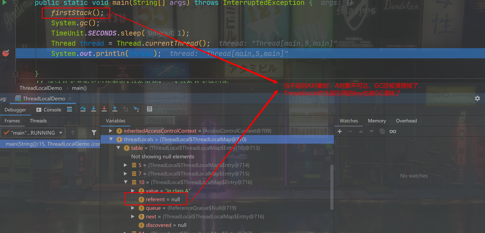

#  谈谈ThreadLocal为什么被设计为弱引用

ThreadLocal在用作ThreadLocalMap的key时，是被设计为弱引用的。

ThreadLocalMap的内部类Entry被设计为实现了WeakReference，Entry用来存放数据。在构造Entry对象时，将传进来的ThreadLocal对象包装成了真正的弱引用对象，而Entry对象和内部的value对象本身是强引用的。

弱引用的解释：

> ​		只具有弱引用的对象拥有更短暂的生命周期。在垃圾回收器线程扫描它所管辖的内存区域的过程中，一旦发现了只具有弱引用的对象，不管当前内存空间足够与否，都会回收它的内存。不过，由于垃圾回收器是一个优先级很低的线程，因此不一定会很快发现那些只具有弱引用的对象。

简单理解就是当垃圾回收时，该对象只被WeakReference对象的弱引用字段（T reference）所引用，而未被任何强类型的对象引用，那么，该弱引用的对象就会被回收。

注意：WeakReference引用本身是强引用，它内部的（T reference）才是真正的弱引用字段，WeakReference就是一个装弱引用的容器而已。

举个例子:

```java
public class ThreadLocalDemo {
    public static void main(String[] args) throws InterruptedException {
        firstStack();
        System.gc();
        TimeUnit.SECONDS.sleep(1);
        Thread thread = Thread.currentThread();
        System.out.println(thread); // 在这里打断点，观察thread对象里的ThreadLocalMap数据

    }
    // 通过是否获取返回值观察A对象里的local对象是否被回收
    private static A firstStack(){
        A a = new A();
        System.out.println("value: "+ a.get());
        return a;
    }
    private static class A{
        private ThreadLocal<String> local = ThreadLocal.withInitial(() -> "in class A");

        public String get(){
            return local.get();
        }
        public void set(String str){
            local.set(str);
        }

    }
}
```


​																	1.ThreadLocal被强引用持有，不会被回收



​																2.ThreadLocal只被弱引用持有，gc后被回收了

如上面的代码，当构造一个A对象时，内部的local对象也构造了，之后调用get和set方法对local对象取值和设置值，当A对象不可达时，垃圾收集器就会回收A。

现在我们假设ThreadLocalMap的Entey里的key（ThreadLocal对象）不是弱引用的，且已经调用了A的对象的get或set方法，那么垃圾收集器回收A对象时，一定不会回收里面的local对象，为什么？

因为Entey已近持有了local对象的引用，我们没有设置引用类型，那这个引用就默认是个强引用。

Thread -> ThreadLocal.ThreadLocalMap -> Entry[] -> Enrty -> key（threadLocal对象）和value

引用链如上面所示，这个引用链全是强引用，当这个线程还未结束时，他持有的强引用，包括递归下去的所有强引用都不会被垃圾回收器回收。

那么回到正常情况，ThreadLocalMap里Entey的key是弱引用，在本例中也就是local对象在这里是弱引用，当对象A回收时，由于local对象只剩下被弱引用key所引用，所以local对象也会被回收。

### 重点来了，key为什么被设计为弱引用？？

回归本质，ThreadLocalMap是用来存放对象的，在一次线程的执行栈中，存放数据后方便我们在任意的地方取得我们想要的值而不被其他线程干扰。ThreadLocalMap本身并没有为外界提供取出和存放数据的API，我们所能获得数据的方式只有通过ThreadLocal类提供的API来间接的从ThreadLocalMap取出数据，所以，当我们用不了key（ThreadLocal对象）的API也就无法从ThreadLocalMap里取出指定的数据。

在上面的例子中，A对象被回收了，这些get和set方法也访问不到了，也就没法从ThreadLocalMap里取出数据了。没法利用API取出数据，那这个Entry对象还有用吗？？所以最好的方法是在A对象被回收后，系统自动回收对应的Entry对象，但是让Entry对象或其中的value对象做为弱引用都是非常不合理的。所以，让key（threadLocal对象）为弱引用，自动被垃圾回收，key就变为null了，下次，我们就可以通过Entry不为null，而key为null来判断该Entry对象该被清理掉了。

至于ThreadLocalMap为什么不给外界提供API来操作数据，我觉得是因为这个Map对于一个线程只有一份，任何地方都在用，为了提供更方便的API和为了我们不破换其他框架保存到里面的数据，所以才用ThreadLocal作为key和API来操作数据。

## 总结

综上，Entry的key被设计为弱引用就是为了让程序自动的对访问不到的数据进行回收提醒，所以，在访问不到的数据被回收之前，内存泄漏确实是存在的，但是我们不用担心，就算我们不调用remove，ThreadLocalMap在内部的set，get和扩容时都会清理掉泄漏的Entry，内存泄漏完全没必要过于担心

所以，ThreadLocal的建议使用方法：

1.设计为static的，被class对象给强引用，线程存活期间就不会被回收，也不用remove，完全不用担心内存泄漏

2.设计为非static的，长对象（比如被spring管理的对象）的内部，也不会被回收

3.在方法中创建ThreadLocal对象，最好也让ThreadLocal对象被生命周期长的对象引用上

个人也觉得没必要让创建的ThreadLocal对象生命周期过短，ThreadLocal被设计出来本身就是用来跨方法栈获取当前线程的数据或者无锁的获取线程安全的数据，空间交换了线程安全的上锁时间。只要让ThreadLocal具有线程的生命周期，就完全没必要使用remove方法，也完全不用担心内存泄漏的问题。

另外说一点，HashMap是使用拉链法解决hash冲突的，ThreadLocalMap是使用线性探测解决hash冲突的（内部只维护Entey数组，没有链表）。所以，源码中在清除泄漏的Entry时，会进行rehash，防止数组的当前位置为null后，有hash冲突的Entry访问不到的问题。


> 卸载类的条件：
>
> ​		1.该类所有的实例都已经被回收，也就是Java堆中不存在该类的任何实例。
>
> ​		2.加载该类的ClassLoader已经被回收。
>
> ​		3.该类对应的java.lang.Class对象没有在任何地方被引用，无法在任何地方通过反射访问该 类的方法。 注意：虚拟机可以对满足上述3个条件的无用类进行回收，这里说的仅仅是“可以”，而并不是 和对象一样，