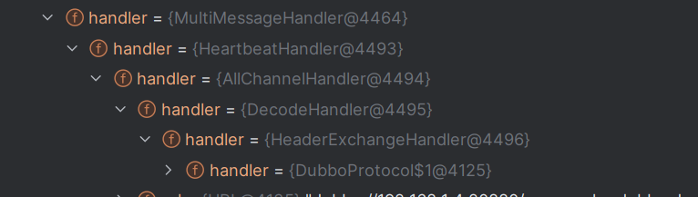

#   dubbo（2.7.16）

## 1 provider(@DubboService)

以**@DubboService**注解的类或用xml配置的**dubbo:servi**ce标签配置的类最终都会转化为**ServiceBean对象**，当这个bean初始化后，会将自己放入org.apache.dubbo.config.context.ConfigManager#configsCache里（addIntoConfigManager方法），等待后续的export

**procider的export流程（spring环境）：**

>  ContextRefreshedEvent触发DubboBootstrap的启用，在内部会拿到ConfigManager#configsCache里所有的service，依次去export（org.apache.dubbo.config.ServiceConfig#export这个方法）

export流程和下面的reference类似

- 利用ProxyFactory创建代理（默认javassist），并封装为一个ProxyInvoker。内部的ref为真正的实现类
- 对上面的ProxyInvoker进行export，首先会对其使用的注册中心export（RegistryProtocol#export方法）
  - 在里面进行一些列的URL设置，对protocol为dubbo的URL进行export（DubboProtocol#export方法）
  - DubboProtocol#export内部创建DubboExporter并将其缓存到AbstractProtocol#exporterMap里（用于后续的Invoker查找），随后启动Netty服务端（**包括设置一系列的ChannelHandler，其中最重要的是DubboProtocol#requestHandler**。监听端口，最终启动ServerBootstrap）
  - 随后注册并订阅到zookeeper
- 上述创建的Invoker最终会包装成一个FilterNode（里面是一个过滤器链，比如有ExceptionFilter）。**过滤器的最后面才是上述的ProxyInvoker，由它去执行真正的方法调用**

**完整的provider执行流程（从netty监听的端口接收到数据开始执行）**：

> netty的channel开始read到数据 -> DecodeHandler（解码数据）-> HeaderExchangeHandler（request判断）-> DubboProtocol#requestHandler调用reply方法（从缓存里拿到当前Invocation对应的Invoker） -> 这个Invoker是FilterNode，执行一些列的过滤操作 -> ProxyInvoker（由javassist生成的动态代理类，内部使用真正的实现类去调用方法）

## 2 consumer(@DubboReference)

consumer创建流程：以**@DubboReference**注解的字段或者用xml配置的**dubbo:reference**标签配置的类最终都会转换成ReferenceBean对象并添加到spring的IOC容器中等待spring将其初始化。其初始化主要流程（以Zookeeper为注册中心为例）  

- 添加各种参数
- 获取该Reference对应的registry配置，并使用RegistryProtocol#refer方法初始化Invoker
  - 利用registry标签创建好ZookeeperRegistry对象
  - 使用默认的FailoverCluster来创建主Cluster（这步中会创建许多Invoker并进行包装，目的就是扩展功能）
  - 将URL转换为protocol为consumer的URL。会用上MigrationRuleListener来创建RegistryDirectory，并转换这个consumer URL在zookeeper中订阅，获取到provider配置后会notify进行创建protocol为dubbo的URL的真正Invoker(DubboInvoker)
  - 利用ProxyFactory的getProxy创建代理对象(默认用JavassistProxyFactory)，里面的handler为**InvokerInvocationHandler**。将上述创建并层层包装好的Invoker放进去
- 最终这个bean就是JavassistProxyFactory创建的proxy对象

**完整的consumer执行流程（从调用proxy对象的方法开始）**

> 发送： proxy调用方法，InvokerInvocationHandler封装RpcInvocation对象 -> MigrationInvoker -> MockClusterInvoker（mock使用）-> 默认的**FailoverClusterInvoker**（**内部会通过RegistryDirectory拿到所有可用的Invoker列表，然后通过负载均算法筛选出一个使用，默认算法为随机**） -> **FilterNode**（各种过滤器的实现，如MonitorFilter）-> **DubboInvoker**：用内部的ExchangeClient来真正发送数据 -> HeaderExchangeClient -> HeaderExchangeChannel#request（重点，异步的实现：**内部使用netty的Channel发送请求，返回一个DefaultFuture，同时会将这个future缓存到DefaultFuture#FUTURES里，以便后续的接受响应处理结果**）
>
> 接收：当客户端netty的Channel接收到response，触发read -> HeaderExchangeHandler#received （这里面会通过请求id拿到request对应的future，之后就是complete future操作了，到这里异步就算完成了。这个id是唯一的，由request创建，发送给服务端，服务端也会返回。）
>
> 因为请求默认是同步的，由AsyncToSyncInvoker实现（内部就是对future超时等待一会）

## 3 dubbo使用netty的ChannelHandler链

​	client的ChannelHandler和server里的childHandler都是这个，最终都是通过DubboProtocol来处理

## 4 cluster（容错实现）

- Failover：失败时立即尝试重新调用（失败重试次数为配置的retries），且会排除以使用的Invoker，全部调用都失败则**会抛出异常**
- Failback：失败重试机制。**失败后，会封装一个定时任务（失败重试次数为retries，默认5秒执行间隔）执行，且立即返回一个空结果**。且下次执行不会用到上次执行时的Invoker。所以，这个机制不会抛出显示的异常，只会记录相关日志
- Failfast：快速失败。失败时直接抛出RpcException
- Failsafe：失败不重试，只会记录错误日志。立即返回一个空结果
- Mock：mock机制。如果方法配置了强制mock（force开头），则强制走mock。未配置mock，就走普通的Invoker。配置了非强制的mock，则先用普通的Invoker，出现异常再使用MockInvoker
- Broadcast：不走负载均衡，向所有的Invoker发起调用，只要有一个出现异常，则会抛出异常。

## 5. route和loadbalance（仅在consumer端使用）

### 5.1 route

> ​		在RouterChain类实现，由AbstractClusterInvoker#invoke方法调用，**当前Invoker从RegistoryDirectory获取到Invoker列表后，在进行路由筛选，让这些路由器都对这些Invoker进行过滤一遍，将符合规则的Invoker收集起来返回给上层，以供后续的loadbalance使用**
>
> ​		路由器举例：MockInvokersSelector，这个路由器专为mock设计，如果当前调用的方法配置了需要mock（attachment存在invocation.need.mock参数），则这个路由器则会筛选出所有Invoker中protocol为mock的Invoker，返回给上层调用者

### 5.2 loadbalance

> ​		在具体的容错cluster中使用，具体方法为AbstractClusterInvoker#select，默认的loadbalance为random，可以由reference配置的参数loadbalance修改。dubbo提供部分的负载均衡器如下
>
> - random（RandomLoadBalance）：默认使用，**加权随机负载均衡器，按权重设置随机概率**
> - roundrobin（RoundRobinLoadBalance）：**加权轮询，根据权重轮询选择**
> - leastactive（LeastActiveLoadBalance）：**最少活跃调用数**，相同活跃数的随机，活跃数指调用前后计数差。使慢的提供者收到更少请求，因为越慢的提供者的调用前后计数差会越大。
> - consistenthash（ConsistentHashLoadBalance）：**一致性Hash均衡算法**。根据服务提供者ip设置hash环，携带相同的参数总是发送的同一个服务提供者。当某一台提供者挂时，原本发往该提供者的请求，基于虚拟节点，平摊到其它提供者，不会引起剧烈变动。
> - shortestresponse（ShortestResponseLoadBalance）：**加权最短响应优先**，在最近一个滑动窗口中，响应时间越短，越优先调用

## 6 异步的实现（基于Netty）

consumer发起调用 -> InvokerInvocationHandler -> DubboInvoker#doInvoke（省略了中间的Invoker） -> HeaderExchangeChannel#request -> NettyChannel#send（到这里调用方线程结束了）

那当前线程调用结束了，如何收到结果的呢？一切都基于Netty的异步来实现

在上述调用流程的HeaderExchangeChannel#request里，构造了一个新的结果Future，在DefaultFuture类的构造方法中，有两个非常重要的缓存：

- **FUTURES：缓存了某个请求对应的结果future（key为requestId，value为future）**

- CHANNELS：缓存了某个请求对应的Channel（key为requestId，value为dubbo包装后的Channel）

​         每次调用都会构造Request请求，并创建唯一的请求id（Request的构造方法里），当发送这个请求后，会将这个请求对应的结果future给缓存到上述的DefaultFuture#FUTURES里（请求发送后，此时这个future还没有结果）

​        服务端处理完响应后，重新将requestId封装到Response#mId字段中。客户端收到服务端响应数据时，先会触发netty对应channel的read操作，通过客户端配置的一些列ChannelHandler处理后得到的数据为Reponse，这时的线程为netty线程（NioEventLoop）,走到HeaderExchangeHandler#received方法，在这方法内部调用DefaultFuture#received获取到requestId对应的future，再这个future的complete操作。至此，异步调用完成

**总结，线程调用链（consumer端）：**

**请求方（主线程）**：consumer发起调用 -> InvokerInvocationHandler -> DubboInvoker#doInvoke（省略了中间的Invoker） -> HeaderExchangeChannel#request -> NettyChannel#send -> 返回Future（此时future还没有结果，让上层灵活的来处理这个future，可异步，也可异步转同步）

**netty线程（NioEventLoop）**: channel read到数据 -> 一系列ChannelHandler的解码和验证过程 -> HeaderExchangeHandler#received  -> DefaultFuture#received（拿到request对应的future，并complete这个future。至此，超时等待这个future的地方被唤醒，并可获取到结果，两个线程完成了结果传递）

dubbo默认使用同步，由AsyncToSyncInvoker完成，内部实现也很简单，就是超时等待一会

